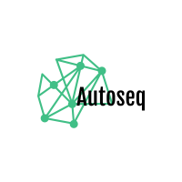
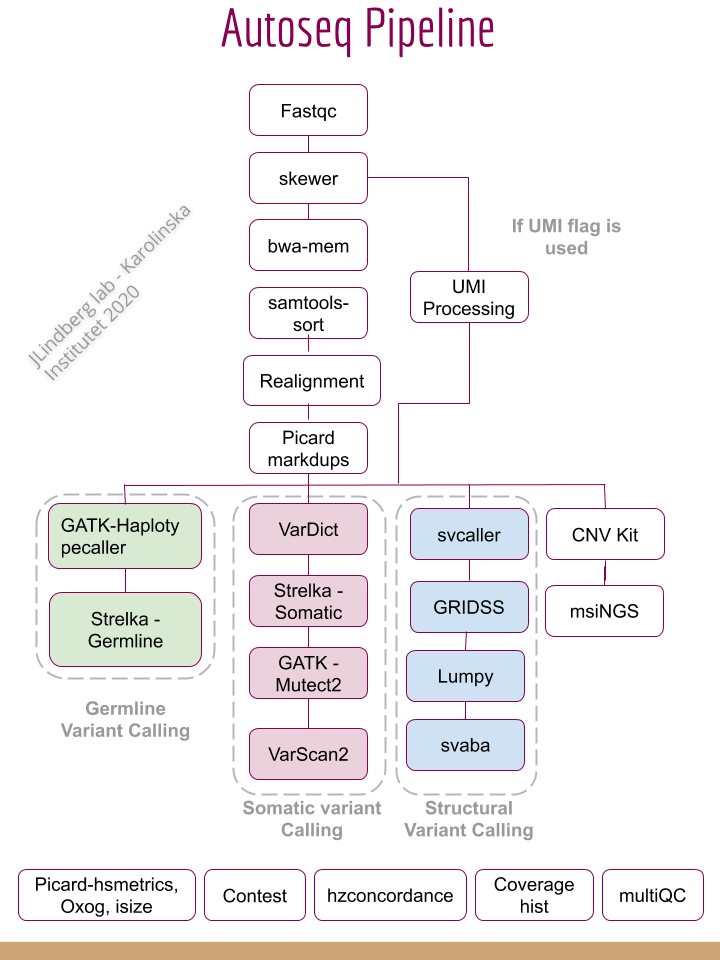
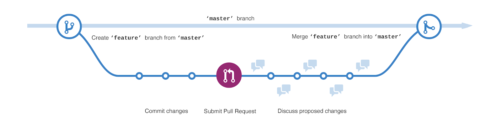

Autoseq framework upgraded with snakemake, docker, python3+ and cloud-compatibility.

<h1>Autoseq framework</h1>

<b>Autoseq</b> consists of a custom-pipeline with additional support modules aimed primarily for the analysis of data from high-throughput sequencing of liquid biopsies. However the pipeline performs equally well with data from tissues with slight change in recommended settings. The pipeline is continuously developed and supported at Johan Lindberg's Cancer Genomics lab at Karolinska Institutet, Stockholm, Sweden. 

This is the latest port of the pipeline to snakemake framework with improvements in containerization, workflow management and upgrades in individual steps like variant calling, alignment and downstream processing of variants. Previous versions of autoseq pipeline have now been discontinued and can be found here (https://github.com/ClinSeq/autoseq). 

In this new version, the focus has been on the forward compatibility of the tools, deployability to cloud environments and improvements in parallelization of compute-intensive and memory-heavy steps.

<h2>Structure</h2>
The repo is organized into four essential compartments -
<ul>
<li><code>rules</code> - all snakemake rule files for various steps and processes in the pipeline</li>
<li><code>config and settings</code> - configuration (*.yaml) files for the pipeline and workflow settings</li>
<li><code>env</code> - all necessary conda and linux environments</li>
<li><code>scripts</code> - supporting scripts and utilities for additional functionalities for the pipeline</li>
</ul>

<h2><a id="user-content-authors" class="anchor" aria-hidden="true" href="#authors"><svg class="octicon octicon-link" viewBox="0 0 16 16" version="1.1" width="16" height="16" aria-hidden="true"><path fill-rule="evenodd" d="M7.775 3.275a.75.75 0 001.06 1.06l1.25-1.25a2 2 0 112.83 2.83l-2.5 2.5a2 2 0 01-2.83 0 .75.75 0 00-1.06 1.06 3.5 3.5 0 004.95 0l2.5-2.5a3.5 3.5 0 00-4.95-4.95l-1.25 1.25zm-4.69 9.64a2 2 0 010-2.83l2.5-2.5a2 2 0 012.83 0 .75.75 0 001.06-1.06 3.5 3.5 0 00-4.95 0l-2.5 2.5a3.5 3.5 0 004.95 4.95l1.25-1.25a.75.75 0 00-1.06-1.06l-1.25 1.25a2 2 0 01-2.83 0z"></path></svg></a>Authors</h2>
<ul>
<li><a href="https://github.com/imsarath" rel="nofollow">Sarath Kumar Murugan</a></li>
<li><a href="https://github.com/drvenki" rel="nofollow">Venkatesh Chellappa</a></li>
<li><a href="https://github.com/rebber" rel="nofollow">Rebecka Bergström</a></li>
<li><a href="https://github.com/karman-ki" rel="nofollow">Karthick Maniram</a></li>    
</ul>

<h2>Pipeline</h2>
NGS-data analysis pipeline written in python for very deep targeted resequencing data from custom panels and works well with targeted or whole-exome data as well.
Contains the essential steps (QC, trimming, alignment, realignment, variant calling, prioritization, reporting). Variants from raw VCF file are annotated using VeP! and run through a set of semantic filters to eliminate irrelevant, invalid and non-significant calls. These filters (frequency, functional significance, relevance to type of disease, etc.) have been implemented after elaborate testing with different settings for both data and the callers. 
The data points in results files are suitable for manual curation in IGV after which they could be exported as a text file or HTML report or a PDF report.

    

<h2>Installation</h2>
<h4><a id="user-content-step-1-obtain-a-copy-of-this-workflow" class="anchor" aria-hidden="true" href="#step-1-obtain-a-copy-of-this-workflow"><svg class="octicon octicon-link" viewBox="0 0 16 16" version="1.1" width="16" height="16" aria-hidden="true"><path fill-rule="evenodd" d="M7.775 3.275a.75.75 0 001.06 1.06l1.25-1.25a2 2 0 112.83 2.83l-2.5 2.5a2 2 0 01-2.83 0 .75.75 0 00-1.06 1.06 3.5 3.5 0 004.95 0l2.5-2.5a3.5 3.5 0 00-4.95-4.95l-1.25 1.25zm-4.69 9.64a2 2 0 010-2.83l2.5-2.5a2 2 0 012.83 0 .75.75 0 001.06-1.06 3.5 3.5 0 00-4.95 0l-2.5 2.5a3.5 3.5 0 004.95 4.95l1.25-1.25a.75.75 0 00-1.06-1.06l-1.25 1.25a2 2 0 01-2.83 0z"></path></svg></a>Step 1: Obtain a copy of this workflow</h4>
<ol>
<li>Create a new github repository using this workflow <a href="https://help.github.com/en/articles/creating-a-repository-from-a-template">as a template</a>.</li>
<li><a href="https://help.github.com/en/articles/cloning-a-repository">Clone</a> the newly created repository to your local system, into the place where you want to perform the data analysis.</li>
</ol>
<h4><a id="user-content-step-2-configure-workflow" class="anchor" aria-hidden="true" href="#step-2-configure-workflow"><svg class="octicon octicon-link" viewBox="0 0 16 16" version="1.1" width="16" height="16" aria-hidden="true"><path fill-rule="evenodd" d="M7.775 3.275a.75.75 0 001.06 1.06l1.25-1.25a2 2 0 112.83 2.83l-2.5 2.5a2 2 0 01-2.83 0 .75.75 0 00-1.06 1.06 3.5 3.5 0 004.95 0l2.5-2.5a3.5 3.5 0 00-4.95-4.95l-1.25 1.25zm-4.69 9.64a2 2 0 010-2.83l2.5-2.5a2 2 0 012.83 0 .75.75 0 001.06-1.06 3.5 3.5 0 00-4.95 0l-2.5 2.5a3.5 3.5 0 004.95 4.95l1.25-1.25a.75.75 0 00-1.06-1.06l-1.25 1.25a2 2 0 01-2.83 0z"></path></svg></a>Step 2: Configure workflow</h4>

Configure the workflow according to your needs via editing the config files <code>config.yaml</code>.

<h4><a id="user-content-step-3-execute-workflow" class="anchor" aria-hidden="true" href="#step-3-execute-workflow"><svg class="octicon octicon-link" viewBox="0 0 16 16" version="1.1" width="16" height="16" aria-hidden="true"><path fill-rule="evenodd" d="M7.775 3.275a.75.75 0 001.06 1.06l1.25-1.25a2 2 0 112.83 2.83l-2.5 2.5a2 2 0 01-2.83 0 .75.75 0 00-1.06 1.06 3.5 3.5 0 004.95 0l2.5-2.5a3.5 3.5 0 00-4.95-4.95l-1.25 1.25zm-4.69 9.64a2 2 0 010-2.83l2.5-2.5a2 2 0 012.83 0 .75.75 0 001.06-1.06 3.5 3.5 0 00-4.95 0l-2.5 2.5a3.5 3.5 0 004.95 4.95l1.25-1.25a.75.75 0 00-1.06-1.06l-1.25 1.25a2 2 0 01-2.83 0z"></path></svg></a>Step 3: Execute workflow</h4>

This workflow will automatically download reference genomes and annotation.
In order to save time and space, consider to use <a href="https://snakemake.readthedocs.io/en/stable/executing/caching.html" rel="nofollow">between workflow caching</a> by adding the flag <code>--cache</code> to any of the commands below.
The workflow already defines which rules are eligible for caching, so no further arguments are required.
When caching is enabled, Snakemake will automatically share those steps between different instances of this workflow.

Test your configuration by performing a dry-run via

<pre><code>snakemake --use-conda -n
</code></pre>

Execute the workflow locally via

<pre><code>snakemake --use-conda --cores $N
</code></pre>

using <code>$N</code> cores or run it in a cluster environment via

<pre><code>snakemake --use-conda --cluster qsub --jobs 100
</code></pre>

or

<pre><code>snakemake --use-conda --drmaa --jobs 100
</code></pre>

If you not only want to fix the software stack but also the underlying OS, use

<pre><code>snakemake --use-conda --use-singularity
</code></pre>

in combination with any of the modes above.

Snakemake 4.0 and later supports execution in the cloud via Kubernetes. This is independent of the cloud provider.

See the <a href="https://snakemake.readthedocs.io/en/stable/executing/cloud.html" rel="nofollow">Snakemake documentation</a> for further details on executing this workflow on the cloud (e.g. cloud execution on AWS via Tibanna or on Google Cloud via Kubernetes).

<h4><a id="user-content-step-4-investigate-results" class="anchor" aria-hidden="true" href="#step-4-investigate-results"><svg class="octicon octicon-link" viewBox="0 0 16 16" version="1.1" width="16" height="16" aria-hidden="true"><path fill-rule="evenodd" d="M7.775 3.275a.75.75 0 001.06 1.06l1.25-1.25a2 2 0 112.83 2.83l-2.5 2.5a2 2 0 01-2.83 0 .75.75 0 00-1.06 1.06 3.5 3.5 0 004.95 0l2.5-2.5a3.5 3.5 0 00-4.95-4.95l-1.25 1.25zm-4.69 9.64a2 2 0 010-2.83l2.5-2.5a2 2 0 012.83 0 .75.75 0 001.06-1.06 3.5 3.5 0 00-4.95 0l-2.5 2.5a3.5 3.5 0 004.95 4.95l1.25-1.25a.75.75 0 00-1.06-1.06l-1.25 1.25a2 2 0 01-2.83 0z"></path></svg></a>Step 4: Investigate results</h4>

After successful execution, you can create a self-contained interactive HTML report with all results via:

<pre><code>snakemake --report report.html
</code></pre>

This report can, e.g., be forwarded to your collaborators.
An example (using some trivial test data) can be seen <a href="report.html" rel="nofollow">here</a>.

<h4><a id="user-content-step-5-commit-changes" class="anchor" aria-hidden="true" href="#step-5-commit-changes"><svg class="octicon octicon-link" viewBox="0 0 16 16" version="1.1" width="16" height="16" aria-hidden="true"><path fill-rule="evenodd" d="M7.775 3.275a.75.75 0 001.06 1.06l1.25-1.25a2 2 0 112.83 2.83l-2.5 2.5a2 2 0 01-2.83 0 .75.75 0 00-1.06 1.06 3.5 3.5 0 004.95 0l2.5-2.5a3.5 3.5 0 00-4.95-4.95l-1.25 1.25zm-4.69 9.64a2 2 0 010-2.83l2.5-2.5a2 2 0 012.83 0 .75.75 0 001.06-1.06 3.5 3.5 0 00-4.95 0l-2.5 2.5a3.5 3.5 0 004.95 4.95l1.25-1.25a.75.75 0 00-1.06-1.06l-1.25 1.25a2 2 0 01-2.83 0z"></path></svg></a>Step 5: Commit changes</h4>

Whenever you change something, don't forget to commit the changes back to your github copy of the repository:

<pre><code>git commit -a
git push
</code></pre>
<h4><a id="user-content-step-6-obtain-updates-from-upstream" class="anchor" aria-hidden="true" href="#step-6-obtain-updates-from-upstream"><svg class="octicon octicon-link" viewBox="0 0 16 16" version="1.1" width="16" height="16" aria-hidden="true"><path fill-rule="evenodd" d="M7.775 3.275a.75.75 0 001.06 1.06l1.25-1.25a2 2 0 112.83 2.83l-2.5 2.5a2 2 0 01-2.83 0 .75.75 0 00-1.06 1.06 3.5 3.5 0 004.95 0l2.5-2.5a3.5 3.5 0 00-4.95-4.95l-1.25 1.25zm-4.69 9.64a2 2 0 010-2.83l2.5-2.5a2 2 0 012.83 0 .75.75 0 001.06-1.06 3.5 3.5 0 00-4.95 0l-2.5 2.5a3.5 3.5 0 004.95 4.95l1.25-1.25a.75.75 0 00-1.06-1.06l-1.25 1.25a2 2 0 01-2.83 0z"></path></svg></a>Step 6: Obtain updates from upstream</h4>

Whenever you want to synchronize your workflow copy with new developments from upstream, do the following.

<ol>
<li>Once, register the upstream repository in your local copy: <code>git remote add -f upstream git@github.com:Clinseq/autoseq-snakemake.git</code> or <code>git remote add -f upstream https://github.com/ClinSeq/autoseq-snakemake.git</code> if you do not have setup ssh keys.</li>
<li>Update the upstream version: <code>git fetch upstream</code>.</li>
<li>Create a diff with the current version: <code>git diff HEAD upstream/master rules scripts envs schemas report &gt; upstream-changes.diff</code>.</li>
<li>Investigate the changes: <code>vim upstream-changes.diff</code>.</li>
<li>Apply the modified diff via: <code>git apply upstream-changes.diff</code>.</li>
<li>Carefully check whether you need to update the config files: <code>git diff HEAD upstream/master config.yaml</code>. If so, do it manually, and only where necessary, since you would otherwise likely overwrite your settings and samples nomenclature.</li>
</ol>

    

<h2>Usage</h2>
<b>Command-line interface</b>

When running from command line or a terminal, the pipeline can be invoked as follows

<pre><code>snakemake --profile_name slurm
</code></pre>

<b>Andromeda Graphical User interface</b>

<i> Note: Requires separate installation of the Andromeda App (api and front-end), configuration of database settings and deployment of the app to authorised local or cloud location. See more on that <a href="https://github.com/ClinSeq/andromeda.git" rel="nofollow">here</a>. </i>

Andromeda is a light-weight app under development at Johan Lindberg's lab at Karolinska Institutet. This app is based on reactJS web-framework that integrates the autoseq-snakemake back-end with supporting databases and a dynamic front-end. Andromeda also shakes hand with other in-house apps like the Curator (for genomic manual curation) and Genomic Leaderboard (for sample logistics and provenance). 

When running from Andromeda, the pipeline can be invoked after logging into the app using 2-FA

<pre>Watch <a href="https://github.com/ClinSeq/andromeda.git" rel="nofollow">Andromeda UI Demo</a> video.</pre>
    

<h2>Settings</h2>
Autoseq pipeline requires the input to be given in a .json format which contains the sample names following a strict naming convention. 

The <code>sample.json</code> file has the format

<pre>{
    "sdid": "NA12877",
    "panel": {
        "T": "NA12877-T-03098849-TD1-TT1",
        "N": "NA12877-N-03098121-TD1-TT1",
        "CFDNA": ["NA12877-CFDNA-03098850-TD1-TT1", "NA12877-CFDNA-03098850-TD2-TT1"]
    },
    "wgs": {
        "T": "NA12877-T-03098849-TD1-WGS",
        "N": "NA12877-N-03098121-TD1-WGS",
        "CFDNA": ["NA12877-CFDNA-03098850-TD1-WGS"]
    }
}
</pre>

