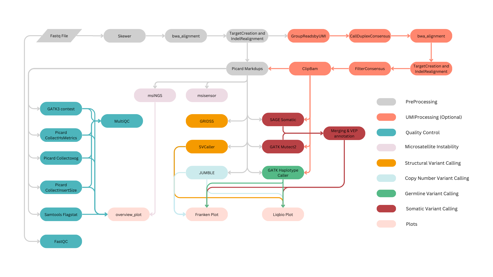
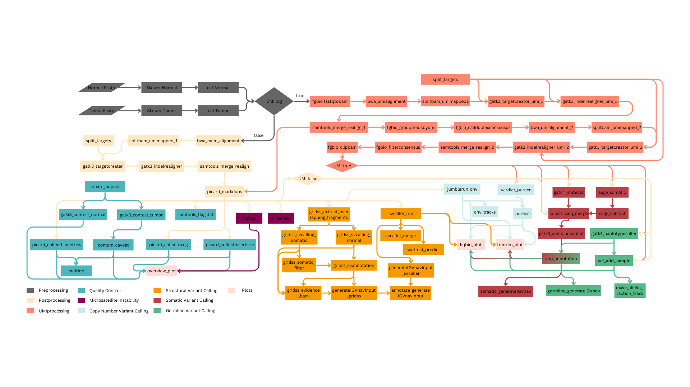

# Autoseq - Pipeline

Autoseq pipeline is specifically designed to run liquid biopsy samples, however, it performs equally well with tissue biopsy samples with minor modification to the recommended settings. This pipeline requires both tumor and matched normal samples; and the input fastq file has to be either in the format of fastq.gz or fq.gz. Additionally, the input file name has to be specified in the format `PROJECT-SDID-TYPE-SAMPLEID-PREPID-CAPTUREID`. For example: PB-P-00462065-CFDNA-04055058-KH20221214-C420221214.fastq.gz. To know more about this format, [visit Barcodes page](barcodes.md). This pipeline can be called either with or without umi parameter. If we specify umi parameter, UMI processing will be performed.

This pipeline can be broadly classified into 7 major steps. They are

* Preprocessing and UMI Processing
* Germline Variant Calling
* Somatic Variant Calling
* Copy Number Variant Calling
* Structural Variant Calling
* Microsatellite Instability
* QC steps 

## Pipeline workflow


**Figure 1:** This diagram shows the overall workflow for autoseq pipeline. Here different type of processes are highlighed with different colors. The preprocessing, UMI processing, microsatellite instability, quality check, somatic variant calling, germline variant calling, copy number analysis, structural variant calling and plots are mentioned in grey, orange, plum, blue, dark orange, green, light blue, dark yellow and light orange respectively. 


**Preprocessing and UMI Processing**

This step covers various sub-steps such as trimming, UMI processing, bwa alignment, indel realignment etc. For trimming the input fastq file, we are using a tool called skewer. It automatically identifies adapter sequence and removes them from each reads. Once trimming process is completed, the resulting trimmed fastq file will be passed to UMI processing step. For UMI pre-procssing we are using fgbio's groupreadsbyumi, callduplexconsensus, and filterconsensus. During UMI preprocessing stage, the input fastq files be converted to ubam file. Then the bwa alignment will be carried out for the trimmed fastq files and the resulting bam file will be merged with the previously generated ubam file, so that the UMI information will be preserved in the final bam file. Then an indel realignment step is performed in the bam file with the help of gatk's targetcreator and indelrealigner to improve the accuracy of alignment near indel regions.

Once the bam file with UMI information is generated and indels regions are re-aligned, we will group reads based on UMI using fgbio's groupreadsbyumi and consequtively call consensus reads with fgbio's callduplexconsensus. The resulting bam file will then be converetd to fastq file, bwa aligned, and indel regions will be re-aligned.    

Once we group reads based on consensus, we can observe that true variants are present in most of the reads that has same UMI, where as false variants that arise due to sequencing error will present only in a small fractions of reads that has same UMI. Fgbio's FilterConsensusReads uses this and few other concept to filter variants that are probably arising from sequencing artifacts. To know more about all the filters that are applied, you can visit [fgbio's FilterConsensusReads page](http://fulcrumgenomics.github.io/fgbio/tools/latest/FilterConsensusReads.html). Finally, fgbio's clipbam is used to clip N bases from the end of either R1 or R2 so that variants present in end of consensus reads are not counted twice (if not clipped, the variants present in both R1 and R2 will be counted as 2 variants; though technically only 1 variant is present in forward and reverse strand.)

Once the preprocessing and UMI processing steps are completed, the remaining steps can be run in parallel.

**Germline Variant Calling**

For normal sample, we use [GATK's haplotypecaller](https://gatk.broadinstitute.org/hc/en-us/articles/360037225632-HaplotypeCaller) to identify all germline variants (including SNPs and INDELs). This tool locates the positions where there is a probable mismatch in bam file and reassembles reads in that region, thus calling variants with increased accuracy. Once the variant call file is generated, it is annotated using [VEP](https://www.ensembl.org/info/docs/tools/vep/index.html).

**Somatic Variant Calling**

To identify somatic variants, we use two different tools. They are [GATK's Mutect2](https://gatk.broadinstitute.org/hc/en-us/articles/360037593851-Mutect2) and [SAGE somatic](https://github.com/hartwigmedical/hmftools/blob/master/sage/README.md). Mutect2 uses a Bayesian somatic genotyping model to identify variants, while SAGE somatic algorithm uses 9 keys steps to call somatic variants. They are Alt Specific Base Quality Recalibration, Candidate Variants, Tumor Counts and Quality, Normal Counts and Quality, Soft Filters, Phasing, De-duplication and Gene Panel Coverage. The variants identified from these two tools will then be merged using [somaticseq](https://github.com/bioinform/somaticseq/blob/master/docs/Manual.pdf) which uses machine learning model to filter out false positive from these two variant callers.

**Copy Number Variant Calling**

For calling copy number variants, we use a tool called JUMBLE. Once copy number analysis is completed, autoseq pipeline will also generate two plots. They are liqbiocna plot and franken plot.  

**Structural Variant Calling**

For structural variant calling, we use [svcaller](https://github.com/tomwhi/svcaller) and [GRIDSS](https://github.com/PapenfussLab/gridss). svcaller uses an algorithm similar to Delly. GRIDSS calls variants based on alignment-guided positional de Bruijn graph genome-wide break-end assembly, split read, and read pair evidence.

**Microsatellite Instability**

Microsatellite Instability provides a glimps into the underlying issues with DNA mismatch repair mechanism. To detect the MSI status, we use two tools called [msiNGS](https://bitbucket.org/uwlabmed/msings/src/master/) and [MSIsensor](https://github.com/ding-lab/msisensor). msiNGS compares the number of differently sized repeats within the microsatellite locus of tumor and normal sample. Loci were considered unstable if the number of repeats in tumor was statistically greater than the number of repeats in normal. MSIsensor uses Pearson's Chi-Squared Test to compare the number of repeats in microsatellite locus between tumor and normal sample.

**QC steps**

Autoseq pipeline utilizes various tools to ensure the generated results in various stages are of good quality. In the initial fastq file, we use [FastQC](https://www.bioinformatics.babraham.ac.uk/projects/fastqc/) to check the quality of input reads. Once the fastq files are aligned, we use [samtools flagstats](http://www.htslib.org/doc/samtools-flagstat.html) to check the overall quality of aligned BAM file. Further, we use various tools in Picard such as [CollectHsMetrics](https://gatk.broadinstitute.org/hc/en-us/articles/360036856051-CollectHsMetrics-Picard) to identify GC bias, [MarkDups](https://gatk.broadinstitute.org/hc/en-us/articles/360037052812-MarkDuplicates-Picard) to identify duplicate reads, [CollectInsertSizeMetrics](https://gatk.broadinstitute.org/hc/en-us/articles/360037055772-CollectInsertSizeMetrics-Picard) and [collectOxoGMetrics](https://gatk.broadinstitute.org/hc/en-us/articles/360037428231-CollectOxoGMetrics-Picard) to validate the library construction process. GATK's [ContEst](https://github.com/broadinstitute/gatk-docs/blob/master/gatk3-tooldocs/3.6-0/org_broadinstitute_gatk_tools_walkers_cancer_contamination_ContEst.html) tool is used to estimate the level of cross contamination between sequencing data. And, finally, purecn is used to estimate tumor purity and ploidy, copy number and loss of heterozygosity.

## Pipeline Detailed Workflow


**Figure 2:** Complete DAG diagram for the autoseq pipeline is shown in this diagram. Here, the postprocessing step is highlighted in light yellow. All other color code is similar to the above diagram.

**Rule fastqc:**

FastQC is a popular bioinformatics tool used for quality control of high-throughput sequencing data, particularly from next-generation sequencing (NGS) platforms. It provides a comprehensive overview of the quality of raw sequence data, helping to identify potential issues before downstream analysis. It generates various metrics such as Per base sequence quality, Per sequence quality scores, Per base sequence content, GC content, Adapter content, Overrepresented sequences.

**Command Used:**
```
mkdir /tmp/skewer-16148c55-9a33-479c-ad21-83aac386b2a6 &&  mkdir -p /path/to/output/P-00476733/PB-P-00476733-CFDNA-04043324-KH20231003-C420231004_PB-P-00476733-N-04043322-KH20231003-C420231004/fastqs/skewer/PB-P-00476733-N-04043322-KH20231003-C420231004 &&  skewer -z -t 4 --quiet  -o /tmp/skewer-16148c55-9a33-479c-ad21-83aac386b2a6/skewer  /path/to/sample_fastq/PB-P-00476733-N-04043322-KH20231003-C420231004/PB-P-00476733-N-04043322-KH20231003-C420231004_S20_L001_R1_001.fastq.gz /path/to/sample_fastq/PB-P-00476733-N-04043322-KH20231003-C420231004/PB-P-00476733-N-04043322-KH20231003-C420231004_S20_L001_R2_001.fastq.gz &&  cp /tmp/skewer-16148c55-9a33-479c-ad21-83aac386b2a6/skewer-trimmed-pair1.fastq.gz /path/to/output/P-00476733/PB-P-00476733-CFDNA-04043324-KH20231003-C420231004_PB-P-00476733-N-04043322-KH20231003-C420231004/fastqs/skewer/PB-P-00476733-N-04043322-KH20231003-C420231004/PB-P-00476733-N-04043322-KH20231003-C420231004_S20_L001_R1_001.fastq.gz &&  cp /tmp/skewer-16148c55-9a33-479c-ad21-83aac386b2a6/skewer-trimmed-pair2.fastq.gz /path/to/output/P-00476733/PB-P-00476733-CFDNA-04043324-KH20231003-C420231004_PB-P-00476733-N-04043322-KH20231003-C420231004/fastqs/skewer/PB-P-00476733-N-04043322-KH20231003-C420231004/PB-P-00476733-N-04043322-KH20231003-C420231004_S20_L001_R2_001.fastq.gz &&  rm -rf /tmp/skewer-16148c55-9a33-479c-ad21-83aac386b2a6 2> /path/to/output/P-00476733/PB-P-00476733-CFDNA-04043324-KH20231003-C420231004_PB-P-00476733-N-04043322-KH20231003-C420231004/logs/skewer/PB-P-00476733-N-04043322-KH20231003-C420231004_S20_L001_-skewer.log
```

**Parameters**
```
-z  → Compress output in GZIP format
-t   → No of threads
-o  → Output file name
--quite → Does not print process update
```

**Rule split_targets:**
Reads “probio_comprehensive4.slopped20.bed” file, takes uniq values of first column (i.e) total no of chromosomes. Then for each chromosomes, create separate bed files (complete line from probio_comprehensive4.slopped20.bed will be written to each chr’s file) inside the output directory.

**Command Used:**
```
mkdir -p /path/to/output/P-00476733/PB-P-00476733-CFDNA-04043324-KH20231003-C420231004_PB-P-00476733-N-04043322-KH20231003-C420231004/bams/split_targets/ && for chr in `cut -f 1 /path/to/autoseq-snakemake/autoseq-genome/intervals/targets/probio_comprehensive4.slopped20.bed | sort | uniq`; do  grep -w $chr /path/to/autoseq-snakemake/autoseq-genome/intervals/targets/probio_comprehensive4.slopped20.bed > /path/to/output/P-00476733/PB-P-00476733-CFDNA-04043324-KH20231003-C420231004_PB-P-00476733-N-04043322-KH20231003-C420231004/bams/split_targets/target.$chr.bed; done
```

**Parameters**
```
mkdir -p  -->  throws no error if directory already exists
cut -f    -->  select only these fields
grep -w   -->  matches whole words
```

**Rule create_popvcf:**
Python code to extract allele frequency and to calculate alternative allele frequency.

**Command Used:**
```
create_contest_vcfs.py /path/to/autoseq-genome/intervals/targets/probio_comprehensive4.slopped20.bed  /path/to/autoseq-genome/intervals/targets/probio_comprehensive4.slopped20.bed /path/to/autoseq-genome/variants/swegen_common.vcf.gz   --tmpdir /tmp   --output-filename /path/to/output/P-00476733/PB-P-00476733-CFDNA-04043324-KH20231003-C420231004_PB-P-00476733-N-04043322-KH20231003-C420231004/contamination/pop_vcf_PB-P-00476733-N-04043322-KH-C4-PB-P-00476733-CFDNA-04043324-KH-C4.vcf 2> /path/to/output/P-00476733/PB-P-00476733-CFDNA-04043324-KH20231003-C420231004_PB-P-00476733-N-04043322-KH20231003-C420231004/logs/contamination/pop_vcf_PB-P-00476733-N-04043322-KH-C4-PB-P-00476733-CFDNA-04043324-KH-C4.log
```

**Parameters**
```
--tmpdir  --> temporary directory
--output-filename  -->  output file name with path
```

**Rule skewer_trim_pe_normal:**
Trim adapter sequences in paired-end reads. Creates temporary directory and runs skewer inside it. Copies results from temp to output directory.

**Command Used:**
```
mkdir /tmp/skewer-3d76e803-0fa3-4f2c-910c-2bdf174aa859 &&  mkdir -p/path/to/outputP-00476733/PB-P-00476733-CFDNA-04043324-KH20231003-C420231004_PB-P-00476733-N-04043322-KH20231003-C420231004/fastqs/skewer/PB-P-00476733-N-04043322-KH20231003-C420231004 &&  skewer -z -t 4 --quiet  -o /tmp/skewer-3d76e803-0fa3-4f2c-910c-2bdf174aa859/skewer /path/to/sample_fastq/PB-P-00476733-N-04043322-KH20231003-C420231004/PB-P-00476733-N-04043322-KH20231003-C420231004_S20_L001_R1_001.fastq.gz/path/to/sample_fastq/PB-P-00476733-N-04043322-KH20231003-C420231004/PB-P-00476733-N-04043322-KH20231003-C420231004_S20_L001_R2_001.fastq.gz &&  cp /tmp/skewer-3d76e803-0fa3-4f2c-910c-2bdf174aa859/skewer-trimmed-pair1.fastq.gz/path/to/outputP-00476733/PB-P-00476733-CFDNA-04043324-KH20231003-C420231004_PB-P-00476733-N-04043322-KH20231003-C420231004/fastqs/skewer/PB-P-00476733-N-04043322-KH20231003-C420231004/PB-P-00476733-N-04043322-KH20231003-C420231004_S20_L001_R1_001.fastq.gz &&  cp /tmp/skewer-3d76e803-0fa3-4f2c-910c-2bdf174aa859/skewer-trimmed-pair2.fastq.gz/path/to/outputP-00476733/PB-P-00476733-CFDNA-04043324-KH20231003-C420231004_PB-P-00476733-N-04043322-KH20231003-C420231004/fastqs/skewer/PB-P-00476733-N-04043322-KH20231003-C420231004/PB-P-00476733-N-04043322-KH20231003-C420231004_S20_L001_R2_001.fastq.gz &&  rm -rf /tmp/skewer-3d76e803-0fa3-4f2c-910c-2bdf174aa859 2>/path/to/outputP-00476733/PB-P-00476733-CFDNA-04043324-KH20231003-C420231004_PB-P-00476733-N-04043322-KH20231003-C420231004/logs/skewer/PB-P-00476733-N-04043322-KH20231003-C420231004_S20_L001_-skewer.log
```

**Parameters**
```
-z  → Compress output in GZIP format
-t   → Number of concurrent threads
-o  → Base name of output file
--quiet → No progress update
```

**Rule cat_normal_fastq,  cat_tumor_fastq:**
Combiles all normal fastq files(skewer trimmed) into a single fastq file and all tumor fastq files(skewer trimmed) into a single fastq file.

**Command Used:**
```
cat file1_S11_L001_R1_001.fastq file3_S11_L001_R1_001.fastq ... > file_S11_L001_R1_001.fastq
cat file1_S11_L001_R2_001.fastq file3_S11_L001_R2_001.fastq ... > file_S11_L001_R2_001.fastq
```

**Rule fgbio_fastqtobam:**
Converts concatenated normal and concatenated tumor into a normal unmapped bam file and tumor unmapped bam file respectively.

**Command Used:**
```
fgbio  -Xmx10g -XX:+AggressiveOpts -XX:ParallelGCThreads=8  --tmp-dir /tmp/fgbio_fastqtobam-f9e0352b-9d3a-4b1c-83ea-e2dc36010f6e FastqToBam  -i /path/to/output/P-00476733/PB-P-00476733-CFDNA-04043324-KH20231003-C420231004_PB-P-00476733-N-04043322-KH20231003-C420231004/fastqs/PB-P-00476733-N-04043322-KH20231003-C420231004_concatenated_1.fastq.gz  /path/to/output/P-00476733/PB-P-00476733-CFDNA-04043324-KH20231003-C420231004_PB-P-00476733-N-04043322-KH20231003-C420231004/fastqs/PB-P-00476733-N-04043322-KH20231003-C420231004_concatenated_2.fastq.gz  -o /path/to/output/P-00476733/PB-P-00476733-CFDNA-04043324-KH20231003-C420231004_PB-P-00476733-N-04043322-KH20231003-C420231004/bams/PB-P-00476733-N-04043322-KH20231003-C420231004_unmapped.bam  --sample PB-P-00476733-N-04043322  --library KH20231003  -r 3M2S+T 3M2S+T  -s true 2> /path/to/output/P-00476733/PB-P-00476733-CFDNA-04043324-KH20231003-C420231004_PB-P-00476733-N-04043322-KH20231003-C420231004/logs/fgbio_fastqtobam_PB-P-00476733-N-04043322-KH20231003-C420231004.log  && rm -rf /tmp/fgbio_fastqtobam-f9e0352b-9d3a-4b1c-83ea-e2dc36010f6e
```

**Parameters**
```
Xmx10g  →  Maximum memory of 10 GB will be used.
XX:+AggressiveOpts  →  experimental performance optimization features that are expected to become default features in future releases. (To improve benchmarks)
XX:ParallelGCThreads  →  number of threads used for garbage collection in the Parallel GC algorithm.
--tmp-dir  → Temporary directory
FastqToBam  →  Generates an unmapped BAM (or SAM or CRAM) file from fastq files
-i   → input fastq files.
-o  → unmapped bam output file.
--sample  →  The name of the sequenced sample.
--library   →  The name/ID of the sequenced library.
-r 3M2S+T 3M2S+T  →  Read structures, one for each of the FASTQs.
	M → Molecular Barcode: the bases in the segment are an index sequence used to identify the unique source molecule being sequence (i.e. a UMI)
	B  → Sample Barcode: the bases in the segment are an index sequence used to identify the sample being sequenced
	S  →  Skip: the bases in the segment should be skipped or ignored, for example if they are monotemplate sequence generated by the library preparation
	T  →  Template: the bases in the segment are reads of template (e.g. genomic dna, rna, etc.)
```

**Rule bwa_umialignment:**
Performs bwa mem alignment on the uBAM converted fastq files (ubam is first converted to fastq file using “picard SamToFastq”) and then runs picard MergeBamAlignment to combine both ubam and aligned bam file.

**Command Used:**
```
picard SamToFastq I=/path/to/output/P-00476733/PB-P-00476733-CFDNA-04043324-KH20231003-C420231004_PB-P-00476733-N-04043322-KH20231003-C420231004/bams/PB-P-00476733-N-04043322-KH20231003-C420231004_unmapped.bam F=/dev/stdout INTERLEAVE=true TMP_DIR=/tmp/bwa-umialignment-5addaa58-d64d-4101-b92c-8cbfa575dae7  | bwa mem -p -t 4 /path/to/autoseq-snakemake/autoseq-genome/bwa/human_g1k_v37_decoy.fasta /dev/stdin  | picard -Djava.io.tmpdir=/tmp/bwa-umialignment-5addaa58-d64d-4101-b92c-8cbfa575dae7   -Xmx10g  MergeBamAlignment  UNMAPPED=/path/to/output/P-00476733/PB-P-00476733-CFDNA-04043324-KH20231003-C420231004_PB-P-00476733-N-04043322-KH20231003-C420231004/bams/PB-P-00476733-N-04043322-KH20231003-C420231004_unmapped.bam  ALIGNED=/dev/stdin  O=/path/to/output/P-00476733/PB-P-00476733-CFDNA-04043324-KH20231003-C420231004_PB-P-00476733-N-04043322-KH20231003-C420231004/bams/PB-P-00476733-N-04043322-KH20231003-C420231004_umimapped.bam R=/path/to/autoseq-snakemake/autoseq-genome/bwa/human_g1k_v37_decoy.fasta  SO=coordinate ALIGNER_PROPER_PAIR_FLAGS=true  MAX_GAPS=-1 ORIENTATIONS=FR CREATE_INDEX=true  TMP_DIR=/tmp/bwa-umialignment-5addaa58-d64d-4101-b92c-8cbfa575dae7 2> /path/to/output/P-00476733/PB-P-00476733-CFDNA-04043324-KH20231003-C420231004_PB-P-00476733-N-04043322-KH20231003-C420231004/logs/bwa_umialignment_PB-P-00476733-N-04043322-KH20231003-C420231004.log && rm -rf /tmp/bwa-umialignment-5addaa58-d64d-4101-b92c-8cbfa575dae7
```

**Parameters**
```
samtofastq
I  → input file
F →output file. (In this case prints to standard output (terminal) which will be piped to next command)
TMP_DIR  → temporary directory
INTERLEAVE  → generate an interleaved fastq if paired, each line will have /1 or /2 to describe which end it came from

bwa mem
-p  → smart pairing
-t   → thread
```

**Rule splitbam_umimapped_1:**
Split the aligned bam file into multiple separate bam file for each chromosome and finally nochr for reads that are aligned to MT or HLA regions.

**Command Used:**
```
output_dir = outdir + "/bams/split_targets/bam/"
bam = input.mapped
prefix = os.path.basename(bam).split('.bam')[0]
no_chr = output_dir + "/{}.nochr.bam".format(prefix)
cmd = "samtools view  -L {} -o {} {} ".format(input.nochr, no_chr, bam)
shell(cmd)
for chr in all_chromosomes:
        run_cmd = "samtools view -b {} {} ".format(bam, chr) + \
             " > {}/{}.{}.bam && ".format(output_dir, prefix, chr) + \
              " samtools index {}/{}.{}.bam ".format(output_dir, prefix, chr)
        shell(run_cmd)
```

**Parameters**
```
-L bedfile.bed       → only include reads overlapping this BED file.
-o file              → output file name
-b                   → output is in BAM format

```

**Rule gatk3_targetcreator_umi_1:**
During normal alignment process, reads are aligned to reference genome, each reads are considered individually and a general scoring strategy will be used. Hence, reads with indels may not be aligned properly to the reference genome. Hence, we include two additional steps (gatk RealignerTargetCreator & gatk IndelRealigner) to correct mapping errors made by genome aligners and make read alignments more consistent in regions that contain indels.

Generates a list of locations (interval list file) that should be considered for local realignment. Takes aligned_merged bam file for each chromosome, fasta seq, bed file corresponding to each chromosome, and 1000G_phase1.indels.b37.vcf.gz file and creates intervals file which contains regions that need realignment.

**Command Used:**
```
source activate gatk_3 && gatk3 -Xmx4G -XX:ParallelGCThreads=4 -Djava.io.tmpdir=/tmp/realignerTC-973e2525-1616-4894-b421-667dc27b68f5  -T RealignerTargetCreator  -R /path/to/autoseq-snakemake/autoseq-genome/genome/human_g1k_v37_decoy.fasta  -known /path/to/autoseq-snakemake/autoseq-genome/variants/1000G_phase1.indels.b37.vcf.gz   -allowPotentiallyMisencodedQuals --maxIntervalSize 20000   -L /path/to/output/P-00476733/PB-P-00476733-CFDNA-04043324-KH20231003-C420231004_PB-P-00476733-N-04043322-KH20231003-C420231004/bams/split_targets/target.8.bed  -known /path/to/autoseq-snakemake/autoseq-genome/variants/Mills_and_1000G_gold_standard.indels.b37.vcf.gz  -I /path/to/output/P-00476733/PB-P-00476733-CFDNA-04043324-KH20231003-C420231004_PB-P-00476733-N-04043322-KH20231003-C420231004/bams/split_targets/bam/PB-P-00476733-N-04043322-KH20231003-C420231004_umimapped.8.bam  -o /path/to/output/P-00476733/PB-P-00476733-CFDNA-04043324-KH20231003-C420231004_PB-P-00476733-N-04043322-KH20231003-C420231004/bams/split_targets/PB-P-00476733-N-04043322-KH20231003-C420231004_umi_8.intervals 2> /path/to/output/P-00476733/PB-P-00476733-CFDNA-04043324-KH20231003-C420231004_PB-P-00476733-N-04043322-KH20231003-C420231004/logs/gatk_realigner_targetcreator_umi_1_PB-P-00476733-N-04043322-KH20231003-C420231004_8.log  && rm -rf /tmp/realignerTC-973e2525-1616-4894-b421-667dc27b68f5
```

**Parameters**
```
-R    →   Reference genome
-known →  known indels
-I      →   input umi-mapped bam file.
-o     →   interval matched output file.
-L     →   directs the GATK engine to restrict processing to specific genomic intervals mentioned in the bed file.
-allowPotentiallyMisencodedQuals  →  This flag tells GATK to ignore warnings when encountering base qualities that are too high and that seemingly indicate a problem with the base quality encoding of the BAM or CRAM file. You should only use this if you really know what you are doing; otherwise you could seriously mess up your data and ruin your analysis.
--maxIntervalSize   →   maximum interval size; any intervals larger than this value will be dropped.
```

**Rule gatk3_indelrealigner_umi_1:**
Indel realignment is performed on the locations mentioned in the interval list file (generated by GATK3 RealignerTargetCreator) in order to correct mapping errors.

**Command Used:**
```
gatk3 -Xmx8G -XX:ParallelGCThreads=4 -Djava.io.tmpdir=/tmp/indelrealigner-a22b635e-5efa-4344-bd24-a5d67234d238  -T IndelRealigner  -R /path/to/autoseq-snakemake/autoseq-genome/genome/human_g1k_v37_decoy.fasta  -targetIntervals /path/to/output/P-NA12877/LB-P-NA12877-CFDNA-03098850-TD1-C31_LB-P-NA12877-N-03098850-TD1-C31/bams/split_targets/LB-P-NA12877-N-03098850-TD1-C31_umi_1.intervals  -known /path/to/autoseq-snakemake/autoseq-genome/variants/1000G_phase1.indels.b37.vcf.gz  -known /path/to/autoseq-snakemake/autoseq-genome/variants/Mills_and_1000G_gold_standard.indels.b37.vcf.gz   -allowPotentiallyMisencodedQuals --maxReadsForRealignment 100000 --maxReadsInMemory 1000000  -I /path/to/output/P-NA12877/LB-P-NA12877-CFDNA-03098850-TD1-C31_LB-P-NA12877-N-03098850-TD1-C31/bams/split_targets/bam/LB-P-NA12877-N-03098850-TD1-C31_umimapped.1.bam  -o /path/to/output/P-NA12877/LB-P-NA12877-CFDNA-03098850-TD1-C31_LB-P-NA12877-N-03098850-TD1-C31/bams/split_targets/bam/LB-P-NA12877-N-03098850-TD1-C31_realigned-1.1.bam 2> /path/to/output/P-NA12877/LB-P-NA12877-CFDNA-03098850-TD1-C31_LB-P-NA12877-N-03098850-TD1-C31/logs/gatk_indel_realigner_umi_1_LB-P-NA12877-N-03098850-TD1-C31_1.log && rm  /path/to/output/P-NA12877/LB-P-NA12877-CFDNA-03098850-TD1-C31_LB-P-NA12877-N-03098850-TD1-C31/bams/split_targets/bam/LB-P-NA12877-N-03098850-TD1-C31_umimapped.1.bam
```

**Parameters**
```
-R    →  Reference Genome
-I      →  input BAM file
-o     →  output BAM file
targetIntervals  →  Interval file containing indel regions which we want to realign.
maxReadsForRealignment  →  Max reads allowed at an interval for realignment
maxReadsInMemory   →  max reads allowed to be kept in memory at a time by the SAMFileWriter
```

**Rule samtools_merge_realign_1:**
Merges all indel realigned BAM files.

**Command Used:**
```
samtools merge -c -p output_merged_bam.bam input_bam_1.bam input_bam_2.bam …
samtools index output_merged_bam.bam
```

**Parameters**
```
-c   →  Combine @RG headers with colliding IDs [alter IDs to be distinct]
-p   →  Combine @PG headers with colliding IDs [alter IDs to be distinct]
```

**Rule fgbio_groupreadsbyumi:**
Group reads based on UMI tags. Reads are first grouped by templates and then each template group are sorted by the 5’ mapping positions of the reads from the template. This step adds MI tags to all reads of the form */A and */B

**Command Used:**
```
fgbio  -Xmx10g -XX:+AggressiveOpts -XX:ParallelGCThreads=8  --tmp-dir /tmp/groupreadsbyumi-7af46ba0-90de-4185-8eb4-f35eb7f0e838 GroupReadsByUmi   -i /path/to/output/P-NA12877/LB-P-NA12877-CFDNA-03098850-TD1-C31_LB-P-NA12877-N-03098850-TD1-C31/bams/LB-P-NA12877-N-03098850-TD1-C31_realigned-1.bam  -o /path/to/output/P-NA12877/LB-P-NA12877-CFDNA-03098850-TD1-C31_LB-P-NA12877-N-03098850-TD1-C31/bams/LB-P-NA12877-N-03098850-TD1-C31_groupedbyumi.bam  --strategy paired  --family-size-histogram /path/to/output/P-NA12877/LB-P-NA12877-CFDNA-03098850-TD1-C31_LB-P-NA12877-N-03098850-TD1-C31/bams/LB-P-NA12877-N-03098850-TD1-C31-groupedbyumi.bam.fs.txt 2> /path/to/output/P-NA12877/LB-P-NA12877-CFDNA-03098850-TD1-C31_LB-P-NA12877-N-03098850-TD1-C31/logs/fgbio_groupreadsbyumi_LB-P-NA12877-N-03098850-TD1-C31.log  && rm -rf /tmp/groupreadsbyumi-7af46ba0-90de-4185-8eb4-f35eb7f0e838
```

**Parameters**
```
--strategy   –> “paired” for paired-end sequencing reads.
--family-size-histogram   --> outputs text file containing tag family size counts
```

**Rule fgbio_callduplexconsensus:**
Calls duplex consensus sequences from reads generated from the same double-stranded source molecule. Reads from the same unique molecule are first partitioned by source strand and assembled into single strand consensus molecules as described by CallMolecularConsensusReads. Subsequently, for molecules that have at least one observation of each strand, duplex consensus reads are assembled by combining the evidence from the two single strand consensus reads.

Consensus reads have a number of additional optional tags set in the resulting BAM file. The tag names follow a pattern where the first letter (a, b or c) denotes that the tag applies to the first single strand consensus (a), second single-strand consensus (b) or the final duplex consensus (c). The second letter is intended to capture the meaning of the tag (e.g. d=depth, m=min depth, e=errors/error-rate) and is upper case for values that are one per read and lower case for values that are one per base.

**Command Used:**
```
fgbio  -Xmx10g -XX:+AggressiveOpts -XX:ParallelGCThreads=8  --tmp-dir /tmp/groupreadsbyumi-d9e370f9-509e-4aac-b3c7-f958312c1c92 CallDuplexConsensusReads   -i /path/to/output/P-NA12877/LB-P-NA12877-CFDNA-03098850-TD1-C31_LB-P-NA12877-N-03098850-TD1-C31/bams/LB-P-NA12877-N-03098850-TD1-C31_groupedbyumi.bam   -o  /path/to/output/P-NA12877/LB-P-NA12877-CFDNA-03098850-TD1-C31_LB-P-NA12877-N-03098850-TD1-C31/bams/LB-P-NA12877-N-03098850-TD1-C31_consensus.bam  --threads 4   --min-reads 1 1 0 --min-input-base-quality 30  2> /path/to/output/P-NA12877/LB-P-NA12877-CFDNA-03098850-TD1-C31_LB-P-NA12877-N-03098850-TD1-C31/logs/fgbio_callduplexconsensus_LB-P-NA12877-N-03098850-TD1-C31.log  && rm -rf /tmp/groupreadsbyumi-d9e370f9-509e-4aac-b3c7-f958312c1c92
```

**Parameters**
```
-i                        -->  groupedbyumi.bam
-o                        -->  consensus.bam
--threads                 -->  number of threads to use while consensus calling
--min-reads               -->  minimum number of input reads to a consensus read
--min-input-base-quality  -->  Ignore bases in raw reads that have Q below this value
```

**Rule bwa_umialignment_2:**
Performs bwa mem alignment on UMI grouped bam file (UMI grouped bam is first converted to fastq file using “picard SamToFastq”) and then runs picard MergeBamAlignment to combine both ubam and aligned bam file.

**Command Used:**
```
picard SamToFastq I=/path/to/output/P-NA12877/LB-P-NA12877-CFDNA-03098850-TD1-C31_LB-P-NA12877-N-03098850-TD1-C31/bams/LB-P-NA12877-CFDNA-03098850-TD1-C31_consensus.bam F=/dev/stdout INTERLEAVE=true TMP_DIR=/tmp/bwa-umialignment-4baeee32-fa4e-4c40-8c9c-69952e72f1ee  | bwa mem -p -t 8 /path/to/autoseq-snakemake/autoseq-genome/bwa/human_g1k_v37_decoy.fasta /dev/stdin  | picard -Djava.io.tmpdir=/tmp/bwa-umialignment-4baeee32-fa4e-4c40-8c9c-69952e72f1ee   -Xmx10g  MergeBamAlignment  UNMAPPED=/path/to/output/P-NA12877/LB-P-NA12877-CFDNA-03098850-TD1-C31_LB-P-NA12877-N-03098850-TD1-C31/bams/LB-P-NA12877-CFDNA-03098850-TD1-C31_consensus.bam  ALIGNED=/dev/stdin  O=/path/to/output/P-NA12877/LB-P-NA12877-CFDNA-03098850-TD1-C31_LB-P-NA12877-N-03098850-TD1-C31/bams/LB-P-NA12877-CFDNA-03098850-TD1-C31_umimapped-2.bam R=/path/to/autoseq-snakemake/autoseq-genome/bwa/human_g1k_v37_decoy.fasta  SO=coordinate ALIGNER_PROPER_PAIR_FLAGS=true  MAX_GAPS=-1 ORIENTATIONS=FR CREATE_INDEX=true  TMP_DIR=/tmp/bwa-umialignment-4baeee32-fa4e-4c40-8c9c-69952e72f1ee 2> /path/to/output/P-NA12877/LB-P-NA12877-CFDNA-03098850-TD1-C31_LB-P-NA12877-N-03098850-TD1-C31/logs/bwa_umialignment_2_LB-P-NA12877-CFDNA-03098850-TD1-C31.log
```

**Parameters**
```
samtofastq
I  → input file
F →output file. (In this case prints to standard output (terminal) which will be piped to next command)
TMP_DIR  → temporary directory
INTERLEAVE  → generate an interleaved fastq if paired, each line will have /1 or /2 to describe which end it came from

bwa mem
-p  → smart pairing
-t   → thread
```

**Rule splitbam_umimapped_2:**
Split the aligned bam file into multiple separate bam file for each chromosome and finally nochr for reads that are aligned to MT or HLA regions.

**Command Used:**
```
output_dir = outdir + "/bams/split_targets/bam/"
bam = input.mapped
prefix = os.path.basename(bam).split('.bam')[0]
no_chr = output_dir + "/{}.nochr.bam".format(prefix)
cmd = "samtools view -@ {} -L {} -o {} {} ".format(threads, input.nochr, no_chr, bam)
shell(cmd)
for chr in all_chromosomes:
        run_cmd = "samtools view -@ {} -b {} {} ".format(threads, bam, chr) + \
            " > {}/{}.{}.bam && ".format(output_dir, prefix, chr) + \
            " samtools index {}/{}.{}.bam ".format(output_dir, prefix, chr)
        shell(run_cmd)

```

**Parameters**
```
samtools
-L bedfile.bed → only include reads overlapping this BED file.
-o file        → output file name
-b             → output is in BAM format
-@             → Thread
```

**Rule gatk3_targetcreator_umi_2:**
During normal alignment process, reads are aligned to reference genome, each reads are considered individually and a general scoring strategy will be used. Hence, reads with indels may not be aligned properly to the reference genome. Hence, we include two additional steps (gatk RealignerTargetCreator & gatk IndelRealigner) to correct mapping errors made by genome aligners and make read alignments more consistent in regions that contain indels.

Generates a list of locations (interval list file) that should be considered for local realignment. Takes aligned_merged bam file for each chromosome, fasta seq, bed file corresponding to each chromosome, and 1000G_phase1.indels.b37.vcf.gz file and creates intervals file which contains regions that need realignment.

**Command Used:**
```
gatk3 -Xmx4G -XX:ParallelGCThreads=4 -Djava.io.tmpdir=/tmp/realignerTC-12baba40-761e-4a01-88a6-f107bb3aa23b  -T RealignerTargetCreator  -R /path/to/autoseq-snakemake/autoseq-genome/genome/human_g1k_v37_decoy.fasta  -known /path/to/autoseq-snakemake/autoseq-genome/variants/1000G_phase1.indels.b37.vcf.gz   -allowPotentiallyMisencodedQuals --maxIntervalSize 20000   -L /path/to/output/P-NA12877/LB-P-NA12877-CFDNA-03098850-TD1-C31_LB-P-NA12877-N-03098850-TD1-C31/bams/split_targets/target.20.bed  -known /path/to/autoseq-snakemake/autoseq-genome/variants/Mills_and_1000G_gold_standard.indels.b37.vcf.gz  -I /path/to/output/P-NA12877/LB-P-NA12877-CFDNA-03098850-TD1-C31_LB-P-NA12877-N-03098850-TD1-C31/bams/split_targets/bam/LB-P-NA12877-CFDNA-03098850-TD1-C31_umimapped-2.20.bam  -o /path/to/output/P-NA12877/LB-P-NA12877-CFDNA-03098850-TD1-C31_LB-P-NA12877-N-03098850-TD1-C31/bams/split_targets/bam/LB-P-NA12877-CFDNA-03098850-TD1-C31_consensus_20.intervals 2> /path/to/output/P-NA12877/LB-P-NA12877-CFDNA-03098850-TD1-C31_LB-P-NA12877-N-03098850-TD1-C31/logs/gatk_realigner_targetcreator_umi_2_LB-P-NA12877-CFDNA-03098850-TD1-C31.20.log
```

**Parameters**
```
-R      →   Reference genome
-known  →  known indels
-I      →   input umi-mapped bam file.
-o      →   interval matched output file.
-L      →   directs the GATK engine to restrict processing to specific genomic intervals mentioned in the bed file.
-allowPotentiallyMisencodedQuals  →  This flag tells GATK to ignore warnings when encountering base qualities that are too high and that seemingly indicate a problem with the base quality encoding of the BAM or CRAM file. You should only use this if you really know what you are doing; otherwise you could seriously mess up your data and ruin your analysis.
--maxIntervalSize   →   maximum interval size; any intervals larger than this value will be dropped.
```

**Rule gatk3_indelrealigner_umi_2:**
Indel realignment is performed on the locations mentioned in the interval list file (generated by GATK3 RealignerTargetCreator) in order to correct mapping errors.

**Command Used:**
```
gatk3 -Xmx8G -XX:ParallelGCThreads=4 -Djava.io.tmpdir=/tmp/indelrealigner-a22b635e-5efa-4344-bd24-a5d67234d238  -T IndelRealigner  -R /path/to/autoseq-snakemake/autoseq-genome/genome/human_g1k_v37_decoy.fasta  -targetIntervals /path/to/output/P-NA12877/LB-P-NA12877-CFDNA-03098850-TD1-C31_LB-P-NA12877-N-03098850-TD1-C31/bams/split_targets/LB-P-NA12877-N-03098850-TD1-C31_umi_1.intervals  -known /path/to/autoseq-snakemake/autoseq-genome/variants/1000G_phase1.indels.b37.vcf.gz  -known /path/to/autoseq-snakemake/autoseq-genome/variants/Mills_and_1000G_gold_standard.indels.b37.vcf.gz   -allowPotentiallyMisencodedQuals --maxReadsForRealignment 100000 --maxReadsInMemory 1000000  -I /path/to/output/P-NA12877/LB-P-NA12877-CFDNA-03098850-TD1-C31_LB-P-NA12877-N-03098850-TD1-C31/bams/split_targets/bam/LB-P-NA12877-N-03098850-TD1-C31_umimapped.1.bam  -o /path/to/output/P-NA12877/LB-P-NA12877-CFDNA-03098850-TD1-C31_LB-P-NA12877-N-03098850-TD1-C31/bams/split_targets/bam/LB-P-NA12877-N-03098850-TD1-C31_realigned-1.1.bam 2> /path/to/output/P-NA12877/LB-P-NA12877-CFDNA-03098850-TD1-C31_LB-P-NA12877-N-03098850-TD1-C31/logs/gatk_indel_realigner_umi_1_LB-P-NA12877-N-03098850-TD1-C31_1.log && rm  /path/to/output/P-NA12877/LB-P-NA12877-CFDNA-03098850-TD1-C31_LB-P-NA12877-N-03098850-TD1-C31/bams/split_targets/bam/LB-P-NA12877-N-03098850-TD1-C31_umimapped.1.bam
```

**Parameters**
```
-R    →  Reference Genome
-I      →  input BAM file
-o     →  output BAM file
targetIntervals  →  Interval file containing indel regions which we want to realign.
maxReadsForRealignment  →  Max reads allowed at an interval for realignment
maxReadsInMemory   →  max reads allowed to be kept in memory at a time by the SAMFileWriter
```

**Rule samtools_merge_realign_2:**
Merges all indel realigned BAM files.

**Command Used:**
```
samtools merge -c -p output_merged_bam.bam input_bam_1.bam input_bam_2.bam …
samtools index output_merged_bam.bam
```

**Parameters**
```
-c   →  Combine @RG headers with colliding IDs [alter IDs to be distinct]
-p   →  Combine @PG headers with colliding IDs [alter IDs to be distinct]
```

**Rule fgbio_filterconsensus:**
Filters consensus reads generated by CallDuplexConsensusReads. Two kind of filtering are performed.
(i) Masking/filtering of individual bases in reads. (only when specified explicitly)
(ii) Filtering out of reads. (Read-level filtering is always applied.)

**Command Used:**
```
fgbio  -Xmx10g -XX:+AggressiveOpts -XX:ParallelGCThreads=8  --tmp-dir /tmp/fgbio-filterconsensus-4127c6df-b762-4e83-913a-50711bc6ee27 FilterConsensusReads  -i /path/to/output/P-NA12877/LB-P-NA12877-CFDNA-03098850-TD1-C31_LB-P-NA12877-N-03098850-TD1-C31/bams/LB-P-NA12877-CFDNA-03098850-TD1-C31_realigned-2.bam   -o /path/to/output/P-NA12877/LB-P-NA12877-CFDNA-03098850-TD1-C31_LB-P-NA12877-N-03098850-TD1-C31/bams/LB-P-NA12877-CFDNA-03098850-TD1-C31_consensus_filtered.bam  --ref /path/to/autoseq-snakemake/autoseq-genome/genome/human_g1k_v37_decoy.fasta   --min-reads 1 1 0 --reverse-per-base-tags true --require-single-strand-agreement true     --max-read-error-rate 1 --max-base-error-rate 0    --min-base-quality 30  2> /path/to/output/P-NA12877/LB-P-NA12877-CFDNA-03098850-TD1-C31_LB-P-NA12877-N-03098850-TD1-C31/logs/fgbio_filter_consensus_LB-P-NA12877-CFDNA-03098850-TD1-C31.log  && rm -rf /tmp/fgbio-filterconsensus-4127c6df-b762-4e83-913a-50711bc6ee27
```

**Parameters**
```
-i                       →  consensus indel_realigned input BAM file
-o                       →  consensus filtered BAM file
--tmp-dir                →  Temporary Directory
--ref                    →  Reference Sequence
--min-reads              → minimum number of reads supporting a consensus base/read
--reverse-per-base-tags  →  Reverse [complement] per base tags on reverse strand reads.
--require-single-strand-agreement →  Mask (make N) consensus bases where the AB and BA consensus reads disagree (for duplex-sequencing only)
--max-read-error-rate    →  The maximum raw-read error rate across the entire consensus read.
--max-base-error-rate    →  The maximum error rate for a single consensus base.
--min-base-quality       →  Mask (make N) consensus bases with quality less than this threshold.
```

**Rule fgbio_clipbam:**
Clip reads from same template (i.e either forward read or reverse read is clipped). This ensures that downstream processes, particularly variant calling, cannot double-count evidence from the same template when both reads span a variant site in the same template. Clipping overlapping reads is only performed on FR read pairs.

**Command Used:**
```
fgbio  -Xmx10g -XX:+AggressiveOpts -XX:ParallelGCThreads=8  --tmp-dir /tmp/fgbio-clipbam-55070876-c19f-453e-9e4b-568086d11fba ClipBam  -i  /path/to/output/P-NA12877/LB-P-NA12877-CFDNA-03098850-TD1-C31_LB-P-NA12877-N-03098850-TD1-C31/bams/LB-P-NA12877-CFDNA-03098850-TD1-C31_consensus_filtered.bam   -o /path/to/output/P-NA12877/LB-P-NA12877-CFDNA-03098850-TD1-C31_LB-P-NA12877-N-03098850-TD1-C31/bams/LB-P-NA12877-CFDNA-03098850-TD1-C31_clipoverlap.bam   -m  /path/to/output/P-NA12877/LB-P-NA12877-CFDNA-03098850-TD1-C31_LB-P-NA12877-N-03098850-TD1-C31/bams/LB-P-NA12877-CFDNA-03098850-TD1-C31_clipoverlap_metrix.txt  --ref /path/to/autoseq-snakemake/autoseq-genome/genome/human_g1k_v37_decoy.fasta  --clip-overlapping-reads true 2> /path/to/output/P-NA12877/LB-P-NA12877-CFDNA-03098850-TD1-C31_LB-P-NA12877-N-03098850-TD1-C31/logs/fgbio_clipbam_LB-P-NA12877-CFDNA-03098850-TD1-C31.log  && rm -rf /tmp/fgbio-clipbam-55070876-c19f-453e-9e4b-568086d11fba
```

**Parameters**
```
-i    -->  consensus filtered BAM file of aligned reads in coordinate order
-o    -->  clipped BAM file
-m    -->  output clip metrix
--ref -->  Reference sequence
--clip-overlapping-reads  -->  Clips overlapping reads if set to true
```

**Rule sage_somatic:**
From probio_comprehensive3.slopped20.bed file, uses bedtools merge to combine overlapping fragments to prepare bed file. (i.e) If the bed file contains multiple genes with locations such as chr1:150-187; chr1:178-220; chr1 215-287;  bedtools merge creates combined bed file such that all the above locations are covered eg: chr1:150-287. Sage somatic tool is used to call variants by considering matched normal and known somatic variants.

**Command Used:**
```
source activate gridss-env &&  bedtools merge -i /path/to/autoseq-snakemake/autoseq-genome/intervals/targets/probio_comprehensive3.slopped20.bed > /path/to/output/P-NA12877/LB-P-NA12877-CFDNA-03098850-TD1-C31_LB-P-NA12877-N-03098850-TD1-C31/variants/targets_nonoverlap.bed 2> /path/to/output/P-NA12877/LB-P-NA12877-CFDNA-03098850-TD1-C31_LB-P-NA12877-N-03098850-TD1-C31/logs/variants/LB-P-NA12877-CFDNA-03098850-TD-C3-LB-P-NA12877-N-03098850-TD-C3-sage-somatic.log && java -Xms4G -Xmx32G -cp /path/to/autoseq-snakemake/tools/sage_v3.2.3.jar  com.hartwig.hmftools.sage.SageApplication -threads 16  -reference LB-P-NA12877-N-03098850 -reference_bam /path/to/output/P-NA12877/LB-P-NA12877-CFDNA-03098850-TD1-C31_LB-P-NA12877-N-03098850-TD1-C31/bams/LB-P-NA12877-N-03098850-TD1-C31_clipoverlap.bam -tumor LB-P-NA12877-CFDNA-03098850 -tumor_bam /path/to/output/P-NA12877/LB-P-NA12877-CFDNA-03098850-TD1-C31_LB-P-NA12877-N-03098850-TD1-C31/bams/LB-P-NA12877-CFDNA-03098850-TD1-C31_clipoverlap.bam  -ref_genome_version 37  -ref_genome /path/to/autoseq-snakemake/autoseq-genome/genome/human_g1k_v37_decoy.fasta  -hotspots /path/to/autoseq-snakemake/autoseq-genome/wgs/hartwig/KnownHotspots.somatic.37.vcf.gz  -panel_bed /path/to/output/P-NA12877/LB-P-NA12877-CFDNA-03098850-TD1-C31_LB-P-NA12877-N-03098850-TD1-C31/variants/targets_nonoverlap.bed  -ensembl_data_dir /path/to/autoseq-snakemake/autoseq-genome/wgs/hartwig/ensembl  -hard_min_tumor_vaf 0.0002 -hotspot_min_tumor_qual 150  -hotspot_min_tumor_vaf 0.0002 -min_map_quality 20  -min_avg_base_qual 30 -panel_min_tumor_qual 250  -panel_min_tumor_vaf 0.0002 -panel_only -write_bqr_data  -out /path/to/output/P-NA12877/LB-P-NA12877-CFDNA-03098850-TD1-C31_LB-P-NA12877-N-03098850-TD1-C31/variants/LB-P-NA12877-CFDNA-03098850-TD-C3-LB-P-NA12877-N-03098850-TD-C3-hartwig-sage-somatic.vcf.gz 2>> /path/to/output/P-NA12877/LB-P-NA12877-CFDNA-03098850-TD1-C31_LB-P-NA12877-N-03098850-TD1-C31/logs/variants/LB-P-NA12877-CFDNA-03098850-TD-C3-LB-P-NA12877-N-03098850-TD-C3-sage-somatic.log && rm /path/to/output/P-NA12877/LB-P-NA12877-CFDNA-03098850-TD1-C31_LB-P-NA12877-N-03098850-TD1-C31/variants/targets_nonoverlap.bed
```

**Parameters**
```
bedtools merge
-i  →  input BED file.

SAGE somatic:
-threads        -->  No of threads
-reference      -->  Names of the reference sample
-reference_bam  -->  Path to indexed reference BAM file
-tumor          -->  Name of the tumor sample
-tumor_bam      -->  Paths to indexed tumor BAM file
-ref_genome_version-->  37 (for GRCh37) or 38 (for GRCh38)
-ref_genome     -->  Path to reference genome fasta file
-hotspots       -->  Path to hotspots vcf
-panel_bed      -->  Path to panel bed
-ensembl_data_dir-->  Path to Ensembl data cache
-hard_min_tumor_vaf --> minimum tumor variant allele frequency (Used value: 0.0002)
-hotspot_min_tumor_qual -->   sets the min_tumor_qual to the hotspot tire (Used value:  150)
-hotspot_min_tumor_vaf --> sets the min_tumor_vaf to the hotspot tire (Used value: 0.0002)
-min_map_quality  --> Min mapping quality to apply to non-hotspot variants (Used value: 20)
-min_avg_base_qual -->  Min average base quality hard filter (Used value: 30)
-panel_min_tumor_qual  -->   sets the min_tumor_qual to the panel tire (Used value: 250)
-panel_min_tumor_vaf --> sets the min_tumor_vaf to the panel tire (Used value: 0.0002)
-panel_only     -->  Finds variants only in the regions mentioned in the panel_bed file
-write_bqr_data -->  Generates base quality recalibration table data.
-out            -->  name of output vcf file.
```

**Rule sage_splitvcf:**
Uses bcftools’ filter option to filter out reads that has pass quality. The pass quality reads are then passed to splitVcf.py to split indels and snvs.

**Command Used:**
```
source activate somaticseqenv && bcftools filter -e 'FILTER!="PASS"' /path/to/output/P-NA12877/LB-P-NA12877-CFDNA-03098850-TD1-C31_LB-P-NA12877-N-03098850-TD1-C31/variants/LB-P-NA12877-CFDNA-03098850-TD-C3-LB-P-NA12877-N-03098850-TD-C3-hartwig-sage-somatic.vcf.gz > /path/to/output/P-NA12877/LB-P-NA12877-CFDNA-03098850-TD1-C31_LB-P-NA12877-N-03098850-TD1-C31/variants/LB-P-NA12877-CFDNA-03098850-TD-C3-LB-P-NA12877-N-03098850-TD-C3-hartwig-sage-somatic.pass.vcf && splitVcf.py -infile /path/to/output/P-NA12877/LB-P-NA12877-CFDNA-03098850-TD1-C31_LB-P-NA12877-N-03098850-TD1-C31/variants/LB-P-NA12877-CFDNA-03098850-TD-C3-LB-P-NA12877-N-03098850-TD-C3-hartwig-sage-somatic.pass.vcf -snv /path/to/output/P-NA12877/LB-P-NA12877-CFDNA-03098850-TD1-C31_LB-P-NA12877-N-03098850-TD1-C31/variants/LB-P-NA12877-CFDNA-03098850-TD-C3-LB-P-NA12877-N-03098850-TD-C3-hartwig-sage-somatic.snvs.vcf -indel /path/to/output/P-NA12877/LB-P-NA12877-CFDNA-03098850-TD1-C31_LB-P-NA12877-N-03098850-TD1-C31/variants/LB-P-NA12877-CFDNA-03098850-TD-C3-LB-P-NA12877-N-03098850-TD-C3-hartwig-sage-somatic.indels.vcf &&  bgzip /path/to/output/P-NA12877/LB-P-NA12877-CFDNA-03098850-TD1-C31_LB-P-NA12877-N-03098850-TD1-C31/variants/LB-P-NA12877-CFDNA-03098850-TD-C3-LB-P-NA12877-N-03098850-TD-C3-hartwig-sage-somatic.snvs.vcf && bgzip /path/to/output/P-NA12877/LB-P-NA12877-CFDNA-03098850-TD1-C31_LB-P-NA12877-N-03098850-TD1-C31/variants/LB-P-NA12877-CFDNA-03098850-TD-C3-LB-P-NA12877-N-03098850-TD-C3-hartwig-sage-somatic.indels.vcf
```

**Parameters**
```
bcftools filter 
-e  --> exclude lines that matches the filter

splitVcf.py 
-infile   -->  input VCF file.
-snv      -->  SNV VCF output file
-indel    -->  INDEL VCF output file
```

**Rule gatk4_mutect2:**
Calls somatic variants which includes both SNVs and INDELs. If matched normal is provided, this tool will remove variants that are found in both somatic and germline, and provide variants that are unique to somatic. The resulting file is then passed to GATK’s FilterMutectCalls which filters variants that has equal to or more than 2 alternative allele count. Finally, the resulting vcf file is passed to “vt decompose” which splits multiple allele into separate column. (i.e) If there are two or more allele present in a same location (Eg: chr1:3759889 has 3 alleles such as TA, TAA, TAAA) it will usually be mentioned as TA/TAA/TAAA in normal vcf file; however, when we use vt decompose, the above 3 allele will be recorded in separate column each.

After decomposition, the VCF file is normalized with “vt normalize” which ensures the variant positions are consistent.

**Command Used:**
```
gatk --java-options ' -Xmx10g  -Djava.io.tmpdir=/tmp'  Mutect2  -R /path/to/autoseq-snakemake/autoseq-genome/genome/human_g1k_v37_decoy.fasta  -I /path/to/output/P-NA12877/LB-P-NA12877-CFDNA-03098850-TD1-C31_LB-P-NA12877-N-03098850-TD1-C31/bams/LB-P-NA12877-CFDNA-03098850-TD1-C31_clipoverlap.bam  -I /path/to/output/P-NA12877/LB-P-NA12877-CFDNA-03098850-TD1-C31_LB-P-NA12877-N-03098850-TD1-C31/bams/LB-P-NA12877-N-03098850-TD1-C31_clipoverlap.bam  -tumor LB-P-NA12877-CFDNA-03098850   -normal LB-P-NA12877-N-03098850  -L /path/to/autoseq-snakemake/autoseq-genome/intervals/targets/probio_comprehensive3.slopped20.interval_list  --disable-read-filter MateOnSameContigOrNoMappedMateReadFilter  -bamout /path/to/output/P-NA12877/LB-P-NA12877-CFDNA-03098850-TD1-C31_LB-P-NA12877-N-03098850-TD1-C31/variants/mutect/LB-P-NA12877-N-03098850-TD-C3-LB-P-NA12877-CFDNA-03098850-TD-C3-mutect.bam -O /path/to/output/P-NA12877/LB-P-NA12877-CFDNA-03098850-TD1-C31_LB-P-NA12877-N-03098850-TD1-C31/variants/mutect/LB-P-NA12877-N-03098850-TD-C3-LB-P-NA12877-CFDNA-03098850-TD-C3-gatk-mutect-somatic.vcf.gz 2> /path/to/output/P-NA12877/LB-P-NA12877-CFDNA-03098850-TD1-C31_LB-P-NA12877-N-03098850-TD1-C31/logs/variants/LB-P-NA12877-CFDNA-03098850-TD-C3-LB-P-NA12877-N-03098850-TD-C3-gatk4-mutect-somatic.log &&  gatk --java-options '-Xmx10g -Djava.io.tmpdir=/tmp'  FilterMutectCalls  -R /path/to/autoseq-snakemake/autoseq-genome/genome/human_g1k_v37_decoy.fasta  --max-alt-allele-count 2  -V /path/to/output/P-NA12877/LB-P-NA12877-CFDNA-03098850-TD1-C31_LB-P-NA12877-N-03098850-TD1-C31/variants/mutect/LB-P-NA12877-N-03098850-TD-C3-LB-P-NA12877-CFDNA-03098850-TD-C3-gatk-mutect-somatic.vcf.gz   -O /path/to/output/P-NA12877/LB-P-NA12877-CFDNA-03098850-TD1-C31_LB-P-NA12877-N-03098850-TD1-C31/variants/mutect/LB-P-NA12877-N-03098850-TD-C3-LB-P-NA12877-CFDNA-03098850-TD-C3-gatk-mutect-somatic-filtered.vcf.gz 2>> /path/to/output/P-NA12877/LB-P-NA12877-CFDNA-03098850-TD1-C31_LB-P-NA12877-N-03098850-TD1-C31/logs/variants/LB-P-NA12877-CFDNA-03098850-TD-C3-LB-P-NA12877-N-03098850-TD-C3-gatk4-mutect-somatic.log &&  vt decompose -s /path/to/output/P-NA12877/LB-P-NA12877-CFDNA-03098850-TD1-C31_LB-P-NA12877-N-03098850-TD1-C31/variants/mutect/LB-P-NA12877-N-03098850-TD-C3-LB-P-NA12877-CFDNA-03098850-TD-C3-gatk-mutect-somatic-filtered.vcf.gz  | vt normalize  -r /path/to/autoseq-snakemake/autoseq-genome/genome/human_g1k_v37_decoy.fasta -  | bgzip > /path/to/output/P-NA12877/LB-P-NA12877-CFDNA-03098850-TD1-C31_LB-P-NA12877-N-03098850-TD1-C31/variants/mutect/LB-P-NA12877-N-03098850-TD-C3-LB-P-NA12877-CFDNA-03098850-TD-C3-gatk-mutect-somatic-filtered-normalized.vcf.gz 2>> /path/to/output/P-NA12877/LB-P-NA12877-CFDNA-03098850-TD1-C31_LB-P-NA12877-N-03098850-TD1-C31/logs/variants/LB-P-NA12877-CFDNA-03098850-TD-C3-LB-P-NA12877-N-03098850-TD-C3-gatk4-mutect-somatic.log
```

**Parameters**
```
Mutect2
-R       -->  reference sequence
-I       -->  Input BAM files (if you need to specify both tumor and normal bam file, you can use something like -I tumor.bam -I normal.bam)
-tumor   -->  BAM sample name of tumor
-normal  -->  BAM sample name of normal
-L       -->  One or more genomic intervals over which to operate
--disable-read-filter MateOnSameContigOrNoMappedMateReadFilter  --> Read filters to be disabled before analysis
-bamout  -->  File to which assembled haplotypes should be written
-O       -->  Output file to which variants should be written

gatk FilterMutectCalls
-R       -->  Reference sequence file
--max-alt-allele-count 2  --> Maximum alt alleles per site.
-V       -->  A VCF file containing variants
-O       -->  The output filtered VCF file

vt decompose 
-s       -->  splits up INFO and GENOTYPE fields that have number counts of R and A

vt normalize  
-r       -->  Reference sequence
```

**Rule somaticseq_merge:**
It combines the results from multiple somatic mutation callers, extract genomic and sequencing features for each variant call from the BAM files. It uses machine learning techniques to distinguish true mutations from false positives.

**Command Used:**
```
source activate somaticseqenv && run_somaticseq.py  --output-directory /path/to/output/P-NA12877/LB-P-NA12877-CFDNA-03098850-TD1-C31_LB-P-NA12877-N-03098850-TD1-C31/variants/LB-P-NA12877-CFDNA-03098850-TD-C3-LB-P-NA12877-N-03098850-TD-C3-somaticseq  --genome-reference /path/to/autoseq-snakemake/autoseq-genome/genome/human_g1k_v37_decoy.fasta paired  --tumor-bam-file /path/to/output/P-NA12877/LB-P-NA12877-CFDNA-03098850-TD1-C31_LB-P-NA12877-N-03098850-TD1-C31/bams/LB-P-NA12877-CFDNA-03098850-TD1-C31_clipoverlap.bam  --normal-bam-file /path/to/output/P-NA12877/LB-P-NA12877-CFDNA-03098850-TD1-C31_LB-P-NA12877-N-03098850-TD1-C31/bams/LB-P-NA12877-N-03098850-TD1-C31_clipoverlap.bam  --mutect2-vcf /path/to/output/P-NA12877/LB-P-NA12877-CFDNA-03098850-TD1-C31_LB-P-NA12877-N-03098850-TD1-C31/variants/mutect/LB-P-NA12877-N-03098850-TD-C3-LB-P-NA12877-CFDNA-03098850-TD-C3-gatk-mutect-somatic-filtered-normalized.vcf.gz  --arbitrary-snvs /path/to/output/P-NA12877/LB-P-NA12877-CFDNA-03098850-TD1-C31_LB-P-NA12877-N-03098850-TD1-C31/variants/LB-P-NA12877-CFDNA-03098850-TD-C3-LB-P-NA12877-N-03098850-TD-C3-hartwig-sage-somatic.snvs.vcf.gz  --arbitrary-indels /path/to/output/P-NA12877/LB-P-NA12877-CFDNA-03098850-TD1-C31_LB-P-NA12877-N-03098850-TD1-C31/variants/LB-P-NA12877-CFDNA-03098850-TD-C3-LB-P-NA12877-N-03098850-TD-C3-hartwig-sage-somatic.indels.vcf.gz 2> /path/to/output/P-NA12877/LB-P-NA12877-CFDNA-03098850-TD1-C31_LB-P-NA12877-N-03098850-TD1-C31/logs/variants/LB-P-NA12877-CFDNA-03098850-TD-C3-LB-P-NA12877-N-03098850-TD-C3-somaticseq.log
```

**Parameters**
```
--genome-reference        →  Reference Sequence that was used for alignment.
--tumor-bam-file          →  Tumor BAM file.
--normal-bam-file         →  Normal BAM file.
--mutect2-vcf             →  mutect2 VCF file.
--arbitrary-snvs          →  additional SNV file (in this case, SAGE somatic VCF file)
--arbitrary-indels        →  additional INDEL file
```

**Rule gatk3_combinevariants:**
Combines the indel and snvs VCF file into a single file. The resulting file is compressed and indexed using tabix.

**Command Used:**
```
source activate gatk_3 &&  gatk3 -T CombineVariants  -R /path/to//autoseq-snakemake/autoseq-genome/genome/human_g1k_v37_decoy.fasta --variant /path/to/output/P-00476733/PB-P-00476733-CFDNA-04043324-KH20231003-C420231004_PB-P-00476733-N-04043322-KH20231003-C420231004/variants/PB-P-00476733-CFDNA-04043324-KH-C4-PB-P-00476733-N-04043322-KH-C4-somaticseq/Consensus.sSNV.vcf  --variant /path/to/output/P-00476733/PB-P-00476733-CFDNA-04043324-KH20231003-C420231004_PB-P-00476733-N-04043322-KH20231003-C420231004/variants/PB-P-00476733-CFDNA-04043324-KH-C4-PB-P-00476733-N-04043322-KH-C4-somaticseq/Consensus.sINDEL.vcf  --assumeIdenticalSamples  | bgzip > /path/to/output/P-00476733/PB-P-00476733-CFDNA-04043324-KH20231003-C420231004_PB-P-00476733-N-04043322-KH20231003-C420231004/variants/PB-P-00476733-CFDNA-04043324-KH-C4-PB-P-00476733-N-04043322-KH-C4-all.somatic.vcf.gz &&  tabix -p vcf /path/to/output/P-00476733/PB-P-00476733-CFDNA-04043324-KH20231003-C420231004_PB-P-00476733-N-04043322-KH20231003-C420231004/variants/PB-P-00476733-CFDNA-04043324-KH-C4-PB-P-00476733-N-04043322-KH-C4-all.somatic.vcf.gz 2> /path/to/output/P-00476733/PB-P-00476733-CFDNA-04043324-KH20231003-C420231004_PB-P-00476733-N-04043322-KH20231003-C420231004/logs/variants/PB-P-00476733-CFDNA-04043324-KH-C4-PB-P-00476733-N-04043322-KH-C4-combine_somaticvcf.log
```

**Parameters**
```
-R         →  Reference sequence
--variant  → variant file (either SNV or INDEL file)
--assumeIdenticalSamples → Assume input VCFs have identical sample sets and disjoint calls
tabix -p   → Format of the provided input file (here vcf)
```

**Rule gatk4_haplotypecaller:**
This tool first identifies active regions (i.e regions that show signs of variants) and calls SNPs and INDELs simultaneously via local de-novo assembly of haplotypes in the identified active region. Hence, this tool is able to call germline variants with increased accuracy.

**Command Used:**
```
gatk --java-options ' -Xmx10g '  HaplotypeCaller    -R /path/to/autoseq-snakemake/autoseq-genome/genome/human_g1k_v37_decoy.fasta   -I /path/to/output/P-00476733/PB-P-00476733-CFDNA-04043324-KH20231003-C420231004_PB-P-00476733-N-04043322-KH20231003-C420231004/bams/PB-P-00476733-N-04043322-KH20231003-C420231004_clipoverlap.bam   -L /path/to/autoseq-snakemake/autoseq-genome/intervals/targets/probio_comprehensive4.slopped20.interval_list  --dbsnp /path/to/autoseq-snakemake/autoseq-genome/variants/dbSNP156.hg19.rmcontig.vcf.gz  -O /path/to/output/P-00476733/PB-P-00476733-CFDNA-04043324-KH20231003-C420231004_PB-P-00476733-N-04043322-KH20231003-C420231004/variants/haplotypecaller/PB-P-00476733-N-04043322-KH-C4.haplotypecaller-germline.vcf.gz  2> /path/to/output/P-00476733/PB-P-00476733-CFDNA-04043324-KH20231003-C420231004_PB-P-00476733-N-04043322-KH20231003-C420231004/logs/variants/haplotypecaller/PB-P-00476733-N-04043322-KH-C4.haplotypecaller-germline.log
```

**Parameters**
```
-R       --> Reference sequence file
-I       --> BAM/SAM/CRAM file containing reads
-L       --> One or more genomic intervals over which to operate
--dbsnp  --> dbSNP file
-O       --> Output VCF file

```

**Rule vep_annotation:**
Ensembl VEP is an annotation tool used to annotate variants with information such as the gene affected gene location, gene features, consequence type, the protein sequence change, and the likely functional consequences of the variant.

**Command Used:**
```
source activate ensembl-vep && vep --vcf --output_file STDOUT  --pick --dir /path/to/autoseq-snakemake/autoseq-genome/vep  --fasta /path/to/autoseq-snakemake/autoseq-genome/genome/human_g1k_v37_decoy.fasta  --check_existing  --total_length --allele_number  --no_escape --no_stats --everything --offline  --custom /path/to/autoseq-snakemake/autoseq-genome/variants/BrcaExchangeClinvar_15Jan2019_v26_hg19.vcf.gz,BrcaEx,vcf,exact,0,ClinicalSignificance  --fork 4 --format vcf  -i /path/to/output/P-00476733/PB-P-00476733-CFDNA-04043324-KH20231003-C420231004_PB-P-00476733-N-04043322-KH20231003-C420231004/variants/haplotypecaller/PB-P-00476733-N-04043322-KH-C4.haplotypecaller-germline.vcf.gz > /path/to/output/P-00476733/PB-P-00476733-CFDNA-04043324-KH20231003-C420231004_PB-P-00476733-N-04043322-KH20231003-C420231004/variants/PB-P-00476733-N-04043322-KH-C4-all.germline.vep.vcf && vep --vcf --output_file STDOUT  --pick --dir /path/to/autoseq-snakemake/autoseq-genome/vep  --fasta /path/to/autoseq-snakemake/autoseq-genome/genome/human_g1k_v37_decoy.fasta  --check_existing  --total_length --allele_number  --no_escape --no_stats --everything --offline  --custom /path/to/autoseq-snakemake/autoseq-genome/variants/BrcaExchangeClinvar_15Jan2019_v26_hg19.vcf.gz,BrcaEx,vcf,exact,0,ClinicalSignificance  --fork 4 --format vcf  -i /path/to/output/P-00476733/PB-P-00476733-CFDNA-04043324-KH20231003-C420231004_PB-P-00476733-N-04043322-KH20231003-C420231004/variants/PB-P-00476733-CFDNA-04043324-KH-C4-PB-P-00476733-N-04043322-KH-C4-all.somatic.vcf.gz > /path/to/output/P-00476733/PB-P-00476733-CFDNA-04043324-KH20231003-C420231004_PB-P-00476733-N-04043322-KH20231003-C420231004/variants/PB-P-00476733-CFDNA-04043324-KH-C4-PB-P-00476733-N-04043322-KH-C4-all.somatic.vep.vcf
```

**Parameters**
```
--vcf             -->  Writes output in VCF format.
--output_file     -->  Output file name or results can write to STDOUT by specifying 'STDOUT' as the output file name
--pick            -->  Pick one line or block of consequence data per variant
--dir             -->  Specify the base cache/plugin directory to use.
--check_existing  -->  Checks for the existence of known variants that are co-located with the input. By default the alleles are compared and variants on an allele-specific basis
--total_length    -->  Give cDNA, CDS and protein positions as Position/Length.
--allele_number   -->  Identify allele number from VCF input, where 1 = first ALT allele, 2 = second ALT allele etc.
--no_escape       -->  Don't URI escape HGVS strings. 
--no_stats        -->  Don't generate a stats file
--everything      -->  turns on various options such as (--sift b, --polyphen b, --ccds, --hgvs, --symbol, --numbers, --domains, --regulatory, --canonical, --protein, --biotype, --af, --af_1kg, --af_esp, --af_gnomade, --af_gnomadg, --max_af, --pubmed, --uniprot, --mane, --tsl, --appris, --variant_class, --gene_phenotype, --mirna)
--offline         -->  Enable offline mode; No database connections will be made.
--custom          -->  Add custom annotation to the output. Files must be tabix indexed
BrcaEx,vcf,exact,0,ClinicalSignificance  
--fork            -->  Enable forking, using the specified number of forks (to improve runtime)
--format vcf      -->  Input file format
-i                -->  Input VCF file
```

**Rule vcf_add_sample:**
In this step, we use “vcf_filter.py” script of PyVCF to filter variants based on site quality. Variants that has quality below 5 will be filtered out. The resulting variants are compressed and passed to “vcf_add_sample.py” which takes the VCF file and corresponding BAM file and adds DP, RO, and AO tags to the VCF file. It also optionally filters variants that are homozygous. Finally, the filtered VCF file is tabix indexed.

**Command Used:**
```
vcf_filter.py --no-filtered  /home/curator-analyst-5/data/temp_output/P-00476733/PB-P-00476733-CFDNA-04043324-KH20231003-C420231004_PB-P-00476733-N-04043322-KH20231003-C420231004/variants/haplotypecaller/PB-P-00476733-N-04043322-KH-C4.haplotypecaller-germline.vcf.gz  sq --site-quality 5 | bgzip > /tmp/vcfaddsample-63f143db-fbd9-4e42-b61b-4a6f1d8899a3.vcf.gz &&  vcf_add_sample.py --filter_hom --samplename PB-P-00476733-CFDNA-04043324   /tmp/vcfaddsample-63f143db-fbd9-4e42-b61b-4a6f1d8899a3.vcf.gz  /home/curator-analyst-5/data/temp_output/P-00476733/PB-P-00476733-CFDNA-04043324-KH20231003-C420231004_PB-P-00476733-N-04043322-KH20231003-C420231004/bams/PB-P-00476733-CFDNA-04043324-KH20231003-C420231004_clipoverlap.bam  | bgzip > /home/curator-analyst-5/data/temp_output/P-00476733/PB-P-00476733-CFDNA-04043324-KH20231003-C420231004_PB-P-00476733-N-04043322-KH20231003-C420231004/variants/PB-P-00476733-N-04043322-KH-C4-and-PB-P-00476733-CFDNA-04043324-KH-C4.germline-variants-with-somatic-afs.vcf.gz &&  tabix -p vcf /home/curator-analyst-5/data/temp_output/P-00476733/PB-P-00476733-CFDNA-04043324-KH20231003-C420231004_PB-P-00476733-N-04043322-KH20231003-C420231004/variants/PB-P-00476733-N-04043322-KH-C4-and-PB-P-00476733-CFDNA-04043324-KH-C4.germline-variants-with-somatic-afs.vcf.gz &&  rm /tmp/vcfaddsample-63f143db-fbd9-4e42-b61b-4a6f1d8899a3.vcf.gz
```

**Parameters**
```
vcf_filter.py 
--no-filtered         →  Output only sites passing the filters
sq --site-quality     →  Filter sites below this quality (default: 30)

vcf_add_sample.py 
--filter_hom          →  filter variants that are homozygous (0/0 and 1/1) in any sample in the given vcf
--samplename          →  name of the sample

tabix -p              → Input format for indexing.
```

**Rule make_allelic_fraction_track:**
This script takes vcf file as input and generates allelic fraction (AD/DP) bedgraph

**Command Used:**
```
generate_allelic_fraction_bedGraph.py  --output /path/to/output/P-00476733/PB-P-00476733-CFDNA-04043324-KH20231003-C420231004_PB-P-00476733-N-04043322-KH20231003-C420231004/variants/PB-P-00476733-N-04043322-KH-C4-and-PB-P-00476733-CFDNA-04043324-KH-C4.germline-variants-somatic-afs.bedGraph  /path/to/output/P-00476733/PB-P-00476733-CFDNA-04043324-KH20231003-C420231004_PB-P-00476733-N-04043322-KH20231003-C420231004/variants/PB-P-00476733-N-04043322-KH-C4-and-PB-P-00476733-CFDNA-04043324-KH-C4.germline-variants-with-somatic-afs.vcf.gz
```

**Parameters**
```
--output     --> Output file name
```

**Rule germline_generateIGVnav  &  somatic_generateIGVnav:**
It uses “generateIGVnavInput.py” python code to generate IGVnav input file, which will be used by IGVnav plugin (used for manual review).

**Command Used:**
```
generateIGVnavInput.py /path/to/output/P-00476733/PB-P-00476733-CFDNA-04043324-KH20231003-C420231004_PB-P-00476733-N-04043322-KH20231003-C420231004/variants/PB-P-00476733-N-04043322-KH-C4-all.germline.vep.vcf /path/to/autoseq-snakemake/autoseq-genome/variants/OncoKB_6Mar19_v1.9.txt germline  --cgc /path/to/autoseq-snakemake/autoseq-genome/genes/variant_annotation_for_curator_v1_2023-02-17.txt --output /path/to/output/P-00476733/PB-P-00476733-CFDNA-04043324-KH20231003-C420231004_PB-P-00476733-N-04043322-KH20231003-C420231004/PB-P-00476733-N-04043322-KH-C4-igvnav-input.txt
```

**Parameters**
```
--cgc    --> Cancer Gene Census file
--output --> output file name

```

**Rule vardict_purecn:**
Vardict is one of most widely used variant caller. It implements novel features such as amplicon bias aware variant calling from targeted sequencing experiments, rescue of long indels by realigning bwa soft clipped reads and better scalability. After variant calling, several filters are applied to narrow down variants of interest.

**Command Used:**
```
VarDict -G /path/to/autoseq-snakemake/autoseq-genome/genome/human_g1k_v37_decoy.fasta  -th 4 -f 0.0002 -N PB-P-00476733-CFDNA-04043324 -r 6  -b "/path/to/output/P-00476733/PB-P-00476733-CFDNA-04043324-KH20231003-C420231004_PB-P-00476733-N-04043322-KH20231003-C420231004/bams/PB-P-00476733-CFDNA-04043324-KH20231003-C420231004_clipoverlap.bam|/path/to/output/P-00476733/PB-P-00476733-CFDNA-04043324-KH20231003-C420231004_PB-P-00476733-N-04043322-KH20231003-C420231004/bams/PB-P-00476733-N-04043322-KH20231003-C420231004_clipoverlap.bam"  -c 1 -S 2 -E 3 -g 4 -Q 10 /path/to/autoseq-snakemake/autoseq-genome/intervals/targets/probio_comprehensive4.slopped20.bed  | testsomatic.R  | var2vcf_paired.pl -P 0.9 -m 4.25 -f 0.0002  -N "PB-P-00476733-CFDNA-04043324|PB-P-00476733-N-04043322"  | awk -F$'\t' -v OFS='\t' '{if ($0 !~ /^#/) gsub(/[KMRYSWBVHDX]/, "N", $4) } {print}'  |  awk -F$'\t' -v OFS='\t' '$1!~/^#/ && $4 == $5 {next} {print}' | sed 's/Somatic;/Somatic;SOMATIC;/g'  | sed '/^#CHROM/i ##INFO=<ID=SOMATIC,Number=0,Type=Flag,Description="Somatic event">'  | vcfstreamsort -w 1000  | bcftools view --apply-filters .,PASS  | vcfsorter.pl /path/to/autoseq-snakemake/autoseq-genome/genome/human_g1k_v37_decoy.dict /dev/stdin  | bgzip > /tmp/ac8ca85f-7a90-4216-8f8a-fcbf22ae6608.vcf.gz && tabix -p vcf /tmp/ac8ca85f-7a90-4216-8f8a-fcbf22ae6608.vcf.gz &&  bcftools annotate --annotation /path/to/autoseq-snakemake/autoseq-genome/variants/dbSNP156.hg19.rmcontig.vcf.gz --columns ID  --output-type z --output /path/to/output/P-00476733/PB-P-00476733-CFDNA-04043324-KH20231003-C420231004_PB-P-00476733-N-04043322-KH20231003-C420231004/variants/PB-P-00476733-CFDNA-04043324-KH-C4-PB-P-00476733-N-04043322-KH-C4.vardict-somatic-purecn.vcf.gz /tmp/ac8ca85f-7a90-4216-8f8a-fcbf22ae6608.vcf.gz  && tabix -p vcf /path/to/output/P-00476733/PB-P-00476733-CFDNA-04043324-KH20231003-C420231004_PB-P-00476733-N-04043322-KH20231003-C420231004/variants/PB-P-00476733-CFDNA-04043324-KH-C4-PB-P-00476733-N-04043322-KH-C4.vardict-somatic-purecn.vcf.gz && rm /tmp/ac8ca85f-7a90-4216-8f8a-fcbf22ae6608.vcf.gz
```

**Parameters**
```
VarDict
-G    -->  reference fasta (has to be .fai indexed)
-th   -->  Thread count
-f    -->  The threshold for allele frequency
-N    -->  Sample name 
-r    -->  minimum no of variant reads
-b    -->  indexed BAM file
-c    -->  column for chromosome
-S    -->  column for region start
-E    -->  column for region end
-g    -->  column for gene name
-Q    -->  If set, reads with mapping quality less than INT will be filtered and ignored

var2vcf_paired.pl
-P    -->  The maximum p-value
-m    -->  The maximum mean mismatches allowed
-f    -->  The minimum allele frequency.
-N    -->  sample Name

vcfstreamsort 
-w    -->  number of sites to sort

bcftools view 
--apply-filters  --> Skip sites not present in the filter.

vcfsorter.pl 

tabix -p vcf  -->  Input format for indexing.

bcftools annotate 
--annotation  -->  Bgzip-compressed and tabix-indexed file with annotations
--columns     -->  Comma-separated list of columns or tags to carry over from the annotation file.
--output-type -->  Output format (compressed vcf in this case)
--output      -->  output file name
```

**Rule purecn:**
This package is used to estimate the tumor purity, copy number, and loss of heterozygosity (LOH), and to classifies single nucleotide variants (SNVs) by somatic status and clonality.

**Command Used:**
```
source activate purecn-env && PureCN.R  --out /path/to/output/P-00476733/PB-P-00476733-CFDNA-04043324-KH20231003-C420231004_PB-P-00476733-N-04043322-KH20231003-C420231004/purecn  --sampleid PB-P-00476733-CFDNA-04043324-KH-C4  --segfile /path/to/output/P-00476733/PB-P-00476733-CFDNA-04043324-KH20231003-C420231004_PB-P-00476733-N-04043322-KH20231003-C420231004/cnv/PB-P-00476733-CFDNA-04043324-KH20231003-C420231004_dnacopy.seg  --tumor /path/to/output/P-00476733/PB-P-00476733-CFDNA-04043324-KH20231003-C420231004_PB-P-00476733-N-04043322-KH20231003-C420231004/cnv/PB-P-00476733-CFDNA-04043324-KH20231003-C420231004.cnr  --vcf /path/to/output/P-00476733/PB-P-00476733-CFDNA-04043324-KH20231003-C420231004_PB-P-00476733-N-04043322-KH20231003-C420231004/variants/PB-P-00476733-CFDNA-04043324-KH-C4-PB-P-00476733-N-04043322-KH-C4.vardict-somatic-purecn.vcf.gz  --genome hg19  --funsegmentation none  --minpurity 0.05  --hzdev 0.1   --maxnonclonal 0.2    --minaf 0.01   --error 0.0005  --postoptimize &&   conda deactivate &&  touch /path/to/output/P-00476733/PB-P-00476733-CFDNA-04043324-KH20231003-C420231004_PB-P-00476733-N-04043322-KH20231003-C420231004/purecn/PB-P-00476733-CFDNA-04043324-KH-C4.csv  /path/to/output/P-00476733/PB-P-00476733-CFDNA-04043324-KH20231003-C420231004_PB-P-00476733-N-04043322-KH20231003-C420231004/purecn/PB-P-00476733-CFDNA-04043324-KH-C4_genes.csv  /path/to/output/P-00476733/PB-P-00476733-CFDNA-04043324-KH20231003-C420231004_PB-P-00476733-N-04043322-KH20231003-C420231004/purecn/PB-P-00476733-CFDNA-04043324-KH-C4_variants.csv  /path/to/output/P-00476733/PB-P-00476733-CFDNA-04043324-KH20231003-C420231004_PB-P-00476733-N-04043322-KH20231003-C420231004/purecn/PB-P-00476733-CFDNA-04043324-KH-C4_loh.csv 2> /path/to/output/P-00476733/PB-P-00476733-CFDNA-04043324-KH20231003-C420231004_PB-P-00476733-N-04043322-KH20231003-C420231004/logs/PB-P-00476733-CFDNA-04043324-KH-C4-purecn.log
```

**Parameters**
```
--out         -->  output directory
--sampleid    -->  sample ID
--segfile     -->  Segmentation file
--tumor       -->  tumor coverage, GC-normalized
--vcf         -->  input VCF file
--genome      -->  Genome version: hg18, hg19, or hg38
--funsegmentation -->  Segmentation Algorithm. CBS, PSCBS or none  
--minpurity   -->  Minimum considered purity
--hzdev       -->  Allowed AF deviation from 0.5 for heterozygous SNPs in the normal
--maxnonclonal-->  Maximum genomic fraction assigned to a subclonal copy number state    
--minaf       -->  minimum allelic fraction
--error       -->  Estimated sequencing error rate for artifact filtering
--postoptimize-->  Post-optimization
```

**Rule jumblerun_cnv:**
Jumble is a tool used to detect clinically relevant copy number alterations with high sensitivity and specificity. It is specifically designed for ctDNA where it is not possible to know the cancer DNA fraction in advance.

**Command Used:**
```
source activate jumble-env && jumble-run.R -r /path/to/autoseq-snakemake/autoseq-genome/intervals/targets/comprehensive4_baits_twist.bed.reference.RDS  -b /path/to/output/P-00476733/PB-P-00476733-CFDNA-04043324-KH20231003-C420231004_PB-P-00476733-N-04043322-KH20231003-C420231004/bams/PB-P-00476733-CFDNA-04043324-KH20231003-C420231004_nodups.bam  -o /path/to/output/P-00476733/PB-P-00476733-CFDNA-04043324-KH20231003-C420231004_PB-P-00476733-N-04043322-KH20231003-C420231004/cnv/ 2> /path/to/output/P-00476733/PB-P-00476733-CFDNA-04043324-KH20231003-C420231004_PB-P-00476733-N-04043322-KH20231003-C420231004/logs/variants/PB-P-00476733-CFDNA-04043324-KH20231003-C420231004-jumblerun-cnv.log
```

**Parameters**
```
-r  -->  reference file
-b  -->  input bam file
-o  -->  output directory
```

**Rule :**
This module takes the columns chromosome, start, end, and log2 from .cnr and .cns file and writes them to segments.bedGraph

**Command Used:**
```
awk -F$'\t' -v OFS='\t' '$1 != "chromosome" {print $1"\t"$2"\t"$3"\t"$6}'  /path/to/output/P-00476733/PB-P-00476733-CFDNA-04043324-KH20231003-C420231004_PB-P-00476733-N-04043322-KH20231003-C420231004/cnv/PB-P-00476733-CFDNA-04043324-KH20231003-C420231004.cnr > /path/to/output/P-00476733/PB-P-00476733-CFDNA-04043324-KH20231003-C420231004_PB-P-00476733-N-04043322-KH20231003-C420231004/cnv/PB-P-00476733-CFDNA-04043324-KH20231003-C420231004_profile.bedGraph  && awk -F$'\t' -v OFS='\t' '$1 != "chromosome" {print $1"\t"$2"\t"$3"\t"$5}'  /path/to/output/P-00476733/PB-P-00476733-CFDNA-04043324-KH20231003-C420231004_PB-P-00476733-N-04043322-KH20231003-C420231004/cnv/PB-P-00476733-CFDNA-04043324-KH20231003-C420231004.cns > /path/to/output/P-00476733/PB-P-00476733-CFDNA-04043324-KH20231003-C420231004_PB-P-00476733-N-04043322-KH20231003-C420231004/cnv/PB-P-00476733-CFDNA-04043324-KH20231003-C420231004_segments.bedGraph
```

**Parameters**
```
-F      -->  Field seperator
-v      -->  assigns value to program variable (val=value)
```

**Rule picard_markdups:**
This tools is used to identify duplicates reads (i.e reads originating from the same DNA fragment.) It identifies duplicate reads by comparing sequences in the 5 prime positions of both reads and read-pairs in a SAM/BAM file. After collecting duplicate reads, it differentiates the primary and duplicate reads using an algorithm that ranks reads by the sums of their base-quality scores.

**Command Used:**
```
picard  -Xmx5g -XX:ParallelGCThreads=8  -Djava.io.tmpdir=/tmp/picard-markdups-d48325c9-52ac-4506-8783-75718ee7acff  MarkDuplicates  INPUT=/path/to/output/P-00476733/PB-P-00476733-CFDNA-04043324-KH20231003-C420231004_PB-P-00476733-N-04043322-KH20231003-C420231004/bams/PB-P-00476733-N-04043322-KH20231003-C420231004_realigned-1.bam  METRICS_FILE=/path/to/output/P-00476733/PB-P-00476733-CFDNA-04043324-KH20231003-C420231004_PB-P-00476733-N-04043322-KH20231003-C420231004/qc/picard/PB-P-00476733-N-04043322-KH20231003-C420231004-picard-markdup.metrics.txt     OUTPUT=/dev/stdout REMOVE_DUPLICATES=true  | samtools sort -@ 1 -T /tmp/picard-markdups-d48325c9-52ac-4506-8783-75718ee7acff -o /path/to/output/P-00476733/PB-P-00476733-CFDNA-04043324-KH20231003-C420231004_PB-P-00476733-N-04043322-KH20231003-C420231004/bams/PB-P-00476733-N-04043322-KH20231003-C420231004_nodups.bam 2> /path/to/output/P-00476733/PB-P-00476733-CFDNA-04043324-KH20231003-C420231004_PB-P-00476733-N-04043322-KH20231003-C420231004/logs/picard_markdups_PB-P-00476733-N-04043322-KH20231003-C420231004.log  && samtools index /path/to/output/P-00476733/PB-P-00476733-CFDNA-04043324-KH20231003-C420231004_PB-P-00476733-N-04043322-KH20231003-C420231004/bams/PB-P-00476733-N-04043322-KH20231003-C420231004_nodups.bam  && rm -rf /tmp/picard-markdups-d48325c9-52ac-4506-8783-75718ee7acff
```

**Parameters**
```
INPUT              -->  input file
METRICS_FILE       -->  output metrics file
OUTPUT             -->  output file name
REMOVE_DUPLICATES  -->  if set to true, does not write duplicates to the output file; if set to false, writes them with appropriate flags set.
```

**Rule gatk3_contest_normal  &  gatk3_contest_cancer:**
This tool is used to determine the percent contamination of an input bam by sample, by lane, or in aggregate across all the input reads.

**Command Used:**
```
source activate gatk_3 && gatk3 -Xmx15g -Djava.io.tmpdir=/tmp/gatk3-contest-cancer-20841088-fcfc-48c2-a94b-7ee0f2a47c67 -T ContEst  -R /path/to/autoseq-snakemake/autoseq-genome/genome/human_g1k_v37_decoy.fasta  -I:eval /path/to/output/P-00476733/PB-P-00476733-CFDNA-04043324-KH20231003-C420231004_PB-P-00476733-N-04043322-KH20231003-C420231004/bams/PB-P-00476733-CFDNA-04043324-KH20231003-C420231004_nodups.bam  -I:genotype /path/to/output/P-00476733/PB-P-00476733-CFDNA-04043324-KH20231003-C420231004_PB-P-00476733-N-04043322-KH20231003-C420231004/bams/PB-P-00476733-N-04043322-KH20231003-C420231004_nodups.bam --popfile /path/to/output/P-00476733/PB-P-00476733-CFDNA-04043324-KH20231003-C420231004_PB-P-00476733-N-04043322-KH20231003-C420231004/contamination/pop_vcf_PB-P-00476733-N-04043322-KH-C4-PB-P-00476733-CFDNA-04043324-KH-C4.vcf  --min_genotype_ratio 0.95   -o /path/to/output/P-00476733/PB-P-00476733-CFDNA-04043324-KH20231003-C420231004_PB-P-00476733-N-04043322-KH20231003-C420231004/contamination/PB-P-00476733-CFDNA-04043324-KH-C4.contest.txt 2> /path/to/output/P-00476733/PB-P-00476733-CFDNA-04043324-KH20231003-C420231004_PB-P-00476733-N-04043322-KH20231003-C420231004/logs/contamination/contest-PB-P-00476733-CFDNA-04043324-KH-C4.log  && rm -rf /tmp/gatk3-contest-cancer-20841088-fcfc-48c2-a94b-7ee0f2a47c67
```

**Parameters**
```
-R                    -->  Reference fasta sequence
-I:eval               -->  Tumor bam file
-I:genotype           -->  Normal bam file
--popfile             -->  variant file containing information about the population allele frequencies
--min_genotype_ratio  -->  the ratio of alt to other bases to call a site a hom non-ref variant
-o                    -->  output file name
```

**Rule samtools_flagstat:**
Counts the number of alignments for each FLAG type.

**Command Used:**
```
samtools flagstat -@ 4 -O json /path/to/output/P-00476733/PB-P-00476733-CFDNA-04043324-KH20231003-C420231004_PB-P-00476733-N-04043322-KH20231003-C420231004/bams/PB-P-00476733-N-04043322-KH20231003-C420231004_nodups.bam > /path/to/output/P-00476733/PB-P-00476733-CFDNA-04043324-KH20231003-C420231004_PB-P-00476733-N-04043322-KH20231003-C420231004/qc/samtools/PB-P-00476733-N-04043322-KH20231003-C420231004-flagstats.json 2> /path/to/output/P-00476733/PB-P-00476733-CFDNA-04043324-KH20231003-C420231004_PB-P-00476733-N-04043322-KH20231003-C420231004/logs/samtools/samtools_flagstat_PB-P-00476733-N-04043322-KH20231003-C420231004.log
```

**Parameters**
```
-@        → no of threads
-O json   → generates output in json file format
```

**Rule msings:**
This tool is used to access the microsatellite instability. For each microsatellite locus, the number of differently sized repeats in experimental samples were quantified and compared to a population of normal controls. Loci were considered unstable if the experimental number of repeats was statistically greater than in the control population. MSI status was determined by the fraction of unstable microsatellite loci.

**Command Used:**
```
source activate gatk_3 && run_msings.sh -b /path/to/autoseq-genome/intervals/targets/probio_comprehensive4.msings.bed  -f /path/to/autoseq-genome/genome/human_g1k_v37_decoy.fasta  -i /path/to/autoseq-genome/intervals/targets/probio_comprehensive4.msings.msi_intervals  -n /path/to/autoseq-genome/intervals/targets/probio_comprehensive4.msings.baseline  -o /path/to/output/P-00484999/PB-P-00484999-CFDNA-04244462-KH20240806-C420240807_PB-P-00484999-N-04244461-KH20240806-C420240807/msings-PB-P-00484999-CFDNA-04244462-KH-C4  /path/to/output/P-00484999/PB-P-00484999-CFDNA-04244462-KH20240806-C420240807_PB-P-00484999-N-04244461-KH20240806-C420240807/bams/PB-P-00484999-CFDNA-04244462-KH20240806-C420240807_nodups.bam 2> /path/to/output/P-00484999/PB-P-00484999-CFDNA-04244462-KH20240806-C420240807_PB-P-00484999-N-04244461-KH20240806-C420240807/logs/msings-PB-P-00484999-N-04244461-KH-C4-PB-P-00484999-CFDNA-04244462-KH-C4.log
```

**Parameters**
```
-b  -->  msi bed file, specifying the microsatellite regions for the utilized panel
-f  -->  fasta reference genome
-i  -->  msi intervals file customized for the utilized panel, for internal program use
-n  -->  msi baseline file, based on msi negative samples with the utilized panel
-o  -->  output directory
```

**Rule picard_collecthsmetrics:**
This tool is used to collect hybrid-selection (HS) metrics for a SAM or BAM file. This tool requires SAM or BAM file as well as bait and target interval files which correspond to the capture kit. This tool attempt to measure the reduced representation of reads, in regions that deviate from 50% G/C content.

**Command Used:**
```
picard  -XX:ParallelGCThreads=8   -Djava.io.tmpdir=/path/to/tmp/picard-hsmetrics-e12bee0b-7f0d-4c61-a0fd-d7b39ffa79ac CollectHsMetrics  I=/path/to/output/P-00484999/PB-P-00484999-CFDNA-04244462-KH20240806-C420240807_PB-P-00484999-N-04244461-KH20240806-C420240807/bams/PB-P-00484999-N-04244461-KH20240806-C420240807_nodups.bam   R=/path/to/autoseq-genome/genome/human_g1k_v37_decoy.fasta O=/path/to/output/P-00484999/PB-P-00484999-CFDNA-04244462-KH20240806-C420240807_PB-P-00484999-N-04244461-KH20240806-C420240807/qc/picard/PB-P-00484999-N-04244461-KH20240806-C420240807.picard-hsmetrics.txt TI=/path/to/autoseq-genome/intervals/targets/probio_comprehensive4.slopped20.interval_list  BI=/path/to/autoseq-genome/intervals/targets/probio_comprehensive4.slopped20.interval_list BAIT_SET_NAME=probio_comprehensive4 METRIC_ACCUMULATION_LEVEL=LIBRARY 2> /path/to/output/P-00484999/PB-P-00484999-CFDNA-04244462-KH20240806-C420240807_PB-P-00484999-N-04244461-KH20240806-C420240807/logs/picard/picard_hsmetrics_PB-P-00484999-N-04244461-KH20240806-C420240807.log
```

**Parameters**
```
I                         -->  aligned SAM or BAM file
R                         -->  Reference sequence file
O                         -->  output file to write the metrics to
TI                        -->  An interval list file that contains the locations of the targets
BI                        -->  An interval list file that contains the locations of the baits used
METRIC_ACCUMULATION_LEVEL -->  The level(s) at which to accumulate metrics
```

**Rule contam_caveat:**
This code reads the contest.txt file and checks if the fourth column (contamination column) is greater than specified value (default is 1.0) and writes “FAIL” or “OK” in output file.

**Command Used:**
```
contest_to_contam_caveat.py   /nfs/PROBIO/autoseq-output/P-00484999/PB-P-00484999-CFDNA-04244462-KH20240806-C420240807_PB-P-00484999-N-04244461-KH20240806-C420240807/contamination/PB-P-00484999-CFDNA-04244462-KH-C4.contest.txt  > /nfs/PROBIO/autoseq-output/P-00484999/PB-P-00484999-CFDNA-04244462-KH20240806-C420240807_PB-P-00484999-N-04244461-KH20240806-C420240807/qc/PB-P-00484999-CFDNA-04244462-KH-C4-contam-qc-call.json 2> /nfs/PROBIO/autoseq-output/P-00484999/PB-P-00484999-CFDNA-04244462-KH20240806-C420240807_PB-P-00484999-N-04244461-KH20240806-C420240807/logs/contamination/PB-P-00484999-CFDNA-04244462-KH-C4-contam-caveat.log
```

**Rule picard_collectoxog:**
This tool collect metrics to assess oxidative artifacts. It calculates the Phred-scaled probability that an alternate base call results from an oxidation artifact. This probability score is based on base context, sequencing read orientation, and the characteristic low allelic frequency.

**Command Used:**
```
picard   -XX:ParallelGCThreads=8  -Xmx2g -Djava.io.tmpdir=/path/to/tmp/picard-oxog-7419e5e3-18a4-4824-a4e8-32e1dad21b1f CollectOxoGMetrics I=/path/to/output/P-00484999/PB-P-00484999-CFDNA-04244462-KH20240806-C420240807_PB-P-00484999-N-04244461-KH20240806-C420240807/bams/PB-P-00484999-N-04244461-KH20240806-C420240807_nodups.bam R=/path/to/autoseq-genome/genome/human_g1k_v37_decoy.fasta O=/path/to/output/P-00484999/PB-P-00484999-CFDNA-04244462-KH20240806-C420240807_PB-P-00484999-N-04244461-KH20240806-C420240807/qc/picard/PB-P-00484999-N-04244461-KH20240806-C420240807.picard-oxog.txt 2> /path/to/output/P-00484999/PB-P-00484999-CFDNA-04244462-KH20240806-C420240807_PB-P-00484999-N-04244461-KH20240806-C420240807/logs/picard/picard_xoxg_PB-P-00484999-N-04244461-KH20240806-C420240807.log  && rm -rf /path/to/tmp/picard-oxog-7419e5e3-18a4-4824-a4e8-32e1dad21b1f
```

**Parameters**
```
I     -->  Input BAM file
R     -->  Reference sequence file
O     -->  Output file name
```

**Rule picard_collectinsertsize:**
This tool is used to validate the library construction including the insert size distribution and read orientation of paired-end libraries. This tool outputs the percentages of read pairs in each of the three orientations (FR, RF, and TANDEM) as a histogram. In addition, the insert size distribution is output as both a histogram and as a data table.

**Command Used:**
```
picard   -XX:ParallelGCThreads=8  -Djava.io.tmpdir=/path/to/tmp CollectInsertSizeMetrics H=/dev/null I=/path/to/output/P-00484999/PB-P-00484999-CFDNA-04244462-KH20240806-C420240807_PB-P-00484999-N-04244461-KH20240806-C420240807/bams/PB-P-00484999-N-04244461-KH20240806-C420240807_nodups.bam O=/path/to/output/P-00484999/PB-P-00484999-CFDNA-04244462-KH20240806-C420240807_PB-P-00484999-N-04244461-KH20240806-C420240807/qc/picard/PB-P-00484999-N-04244461-KH20240806-C420240807.picard-insertsize.txt 2> /path/to/output/P-00484999/PB-P-00484999-CFDNA-04244462-KH20240806-C420240807_PB-P-00484999-N-04244461-KH20240806-C420240807/logs/picard/picard_insertsize_PB-P-00484999-N-04244461-KH20240806-C420240807.log
```

**Parameters**
```
H      -->  File to write insert size Histogram chart to
I      -->  Input SAM or BAM file
O      -->  output file name
```

**Rule multiqc:**
MultiQC is a reporting tool which is used to summarise the results of various tools containing multiple samples.

**Command Used:**
```
multiqc /path/to/output/P-00484999/PB-P-00484999-CFDNA-04244462-KH20240806-C420240807_PB-P-00484999-N-04244461-KH20240806-C420240807 -o /path/to/output/P-00484999/PB-P-00484999-CFDNA-04244462-KH20240806-C420240807_PB-P-00484999-N-04244461-KH20240806-C420240807/multiqc -n PB-P-00484999-CFDNA-04244462-KH-C4-multiqc -k json  --data-dir --zip-data-dir -v -f 2> /path/to/output/P-00484999/PB-P-00484999-CFDNA-04244462-KH20240806-C420240807_PB-P-00484999-N-04244461-KH20240806-C420240807/logs/multiqc-PB-P-00484999-N-04244461-KH-C4-PB-P-00484999-CFDNA-04244462-KH-C4.log
```

**Parameters**
```
-o              -->  output directory
-n              -->  file name
-k              -->  Output data format (json in this case)
--data-dir      -->  Force the parsed data directory to be created
--zip-data-dir  -->  Compress the data directory
-v              -->  Increase output verbosity
-f              -->  Overwrite any existing reports
```

**Rule overview_plot:**
This script creates plot showing the distribution of all previous QC values and where the current normal and tumor sample lies within those distributions.

**Command Used:**
```
source activate purecn-env && QC_overview.R  -s PB-P-00484999-N-04244461-KH-C4:PB-P-00484999-CFDNA-04244462-KH-C4 -d /path/to/output/P-00484999/PB-P-00484999-CFDNA-04244462-KH20240806-C420240807_PB-P-00484999-N-04244461-KH20240806-C420240807 -o /path/to/output/P-00484999/PB-P-00484999-CFDNA-04244462-KH20240806-C420240807_PB-P-00484999-N-04244461-KH20240806-C420240807/qc/PB-P-00484999-N-04244461-KH-C4_PB-P-00484999-CFDNA-04244462-KH-C4.qc_overview.pdf -m /path/to/output 2> /path/to/output/P-00484999/PB-P-00484999-CFDNA-04244462-KH20240806-C420240807_PB-P-00484999-N-04244461-KH20240806-C420240807/logs/qc_overview-PB-P-00484999-N-04244461-KH-C4-PB-P-00484999-CFDNA-04244462-KH-C4.log
```

**Parameters**
```
-s    -->  Samples of interest to match with qc file names. If there are more than one file, they must be separated with colon
-d    -->  Analysis directory for samples of interest, in order to separate between the same samples that possibly are being run in multiple analyses
-o    -->  Path to output pdf file and file name
-m    -->  path to main output location (where the results of all output is present)
```

**Rule gridss_extract_overlapping_fragments:**
GRIDSS is a tool used for the detection of genomic rearrangements. “Gridss_extract_overlapping_fragments” module extracts all alignments for read pairs with at least one aligment overlapping set of regions of interest. Correctly handles supplementary alignments.

**Command Used:**
```
source activate gridss-env && gridss_extract_overlapping_fragments -w /path/to/output/P-00484999/PB-P-00484999-CFDNA-04244462-KH20240806-C420240807_PB-P-00484999-N-04244461-KH20240806-C420240807/svs/gridss/  --targetbed  /path/to//autoseq-genome/intervals/targets/probio_comprehensive4.slopped20.bed -j $GRIDSS_JAR  -o /path/to/output/P-00484999/PB-P-00484999-CFDNA-04244462-KH20240806-C420240807_PB-P-00484999-N-04244461-KH20240806-C420240807/svs/gridss/PB-P-00484999-N-04244461-KH20240806-C420240807-gridss-targeted.bam /path/to/output/P-00484999/PB-P-00484999-CFDNA-04244462-KH20240806-C420240807_PB-P-00484999-N-04244461-KH20240806-C420240807/bams/PB-P-00484999-N-04244461-KH20240806-C420240807_nodups.bam && samtools index /path/to/output/P-00484999/PB-P-00484999-CFDNA-04244462-KH20240806-C420240807_PB-P-00484999-N-04244461-KH20240806-C420240807/svs/gridss/PB-P-00484999-N-04244461-KH20240806-C420240807-gridss-targeted.bam && rm -rf  /path/to/output/P-00484999/PB-P-00484999-CFDNA-04244462-KH20240806-C420240807_PB-P-00484999-N-04244461-KH20240806-C420240807/svs/gridss/PB-P-00484999-N-04244461-KH20240806-C420240807-gridss-targeted.bam.gridss.working/
```

**Parameters**
```
-w            -->  working directory to place intermediate, temporary files and GRIDSS metrics
--targetbed   -->  BED regions of interest
-j            -->  location of GRIDSS jar
-o            -->  output BAM
```

**Rule gridss_svcalling_somatic & gridss_svcalling_normal:**
GRIDSS is used to detect structural variants such as translocations, large deletions, duplications, inversions, and more complex genomic rearrangements. This tool uses a genome-wide break-end assembler, as well as a structural variation caller for Illumina sequencing data. This tool takes BAM file as input and performs local re-alignment around potential breakpoints, thus performing a precise reconstruction of structural variants. GRIDSS calls structural variants by analyzing both split reads and read-pair information, and it identifies the exact breakpoint sequences. Once gridss is completed, the output files are moved to output location and indexed using samtools.

**Command Used:**
```
source activate gridss-env && gridss --reference /path/to/autoseq-genome/bwa/human_g1k_v37_decoy.fasta  --jvmheap 10g  --jar $GRIDSS_JAR  -c $GRIDSS_SCRIPT/gridss.properties  --assembly /path/to/output/P-00484999/PB-P-00484999-CFDNA-04244462-KH20240806-C420240807_PB-P-00484999-N-04244461-KH20240806-C420240807/svs/gridss/PB-P-00484999-N-04244461-KH-C4-PB-P-00484999-CFDNA-04244462-KH-C4-assembly.bam  --threads 10 --steps  ALL  --workingdir /path/to/output/P-00484999/PB-P-00484999-CFDNA-04244462-KH20240806-C420240807_PB-P-00484999-N-04244461-KH20240806-C420240807/svs/gridss/PB-P-00484999-CFDNA-04244462-KH-C4/  --output /path/to/output/P-00484999/PB-P-00484999-CFDNA-04244462-KH20240806-C420240807_PB-P-00484999-N-04244461-KH20240806-C420240807/svs/gridss/PB-P-00484999-N-04244461-KH-C4-PB-P-00484999-CFDNA-04244462-KH-C4-gridss.vcf.gz /path/to/output/P-00484999/PB-P-00484999-CFDNA-04244462-KH20240806-C420240807_PB-P-00484999-N-04244461-KH20240806-C420240807/svs/gridss/PB-P-00484999-N-04244461-KH20240806-C420240807-gridss-targeted.bam /path/to/output/P-00484999/PB-P-00484999-CFDNA-04244462-KH20240806-C420240807_PB-P-00484999-N-04244461-KH20240806-C420240807/svs/gridss/PB-P-00484999-CFDNA-04244462-KH20240806-C420240807-gridss-targeted.bam 2> /path/to/output/P-00484999/PB-P-00484999-CFDNA-04244462-KH20240806-C420240807_PB-P-00484999-N-04244461-KH20240806-C420240807/logs/svs/gridss-PB-P-00484999-N-04244461-KH-C4-PB-P-00484999-CFDNA-04244462-KH-C4.log && mv /path/to/output/P-00484999/PB-P-00484999-CFDNA-04244462-KH20240806-C420240807_PB-P-00484999-N-04244461-KH20240806-C420240807/svs/gridss/PB-P-00484999-CFDNA-04244462-KH-C4/PB-P-00484999-CFDNA-04244462-KH20240806-C420240807-gridss-targeted.bam.gridss.working/*sv.bam /path/to/output/P-00484999/PB-P-00484999-CFDNA-04244462-KH20240806-C420240807_PB-P-00484999-N-04244461-KH20240806-C420240807/svs/gridss/PB-P-00484999-CFDNA-04244462-KH-C4-gridss.sv.bam &&  samtools index /path/to/output/P-00484999/PB-P-00484999-CFDNA-04244462-KH20240806-C420240807_PB-P-00484999-N-04244461-KH20240806-C420240807/svs/gridss/PB-P-00484999-CFDNA-04244462-KH-C4-gridss.sv.bam && rm -rf /path/to/output/P-00484999/PB-P-00484999-CFDNA-04244462-KH20240806-C420240807_PB-P-00484999-N-04244461-KH20240806-C420240807/svs/gridss/PB-P-00484999-CFDNA-04244462-KH-C4/
```

**Parameters**
```
--reference   -->  reference genome, must be .fai indexed
--jvmheap     -->  size of JVM heap for the high-memory part of the assembly and variant calling.
--jar         -->  location of GRIDSS jar file
-c            -->  configuration file use to override default GRIDSS settings
--assembly    -->  location of the GRIDSS assembly BAM (will be created by GRIDSS)
--threads     -->  number of threads to use
--steps       -->  processing steps to run. Defaults to all steps. Multiple steps are specified using comma separators. Available steps are preprocess,assemble,call.
--workingdir  -->  path to output folder
--output      -->  output file
```

**Rule gridss_somatic_filter:**
This is a postprocessing script used by GRIDSS to filter and classify structural variants (SVs) into somatic and germline variants. 

**Command Used:**
```
source activate gridss-env && Rscript $GRIDSS_SCRIPT/gridss_somatic_filter -p /path/to/autoseq-genome/pondir  -i /path/to/output/P-00484999/PB-P-00484999-CFDNA-04244462-KH20240806-C420240807_PB-P-00484999-N-04244461-KH20240806-C420240807/svs/gridss/PB-P-00484999-N-04244461-KH-C4-PB-P-00484999-CFDNA-04244462-KH-C4-gridss.vcf.gz  -o /path/to/output/P-00484999/PB-P-00484999-CFDNA-04244462-KH20240806-C420240807_PB-P-00484999-N-04244461-KH20240806-C420240807/svs/gridss/PB-P-00484999-N-04244461-KH-C4-PB-P-00484999-CFDNA-04244462-KH-C4-gridss.filtered.vcf  -s $GRIDSS_SCRIPT --paneldata && bgzip -d /path/to/output/P-00484999/PB-P-00484999-CFDNA-04244462-KH20240806-C420240807_PB-P-00484999-N-04244461-KH20240806-C420240807/svs/gridss/PB-P-00484999-N-04244461-KH-C4-PB-P-00484999-CFDNA-04244462-KH-C4-gridss.filtered.vcf.bgz
```

**Parameters**
```
-p           -->  Directory containing Panel Of Normal bed/bedpe used to filter FP somatic events
-i           -->  Input GRIDSS VCF file
-o           -->  Output file (High confidence somatic subset)
-s           -->  Path to libgridss.R script
--paneldata  -->  Perform panel sequencing data specific filters
```

**Rule gridss_svannotation:**
Takes gridss filtered vcf file and annotate the type of variants. (i.e) Updates either Transversion(TRA) or Inversion(INV) or Insertion(INS) or Deletion(DEL) or Duplication(DUP)

**Command Used:**
```
source activate gridss-env && gridss_svannotate.R -v /path/to/output/P-00484999/PB-P-00484999-CFDNA-04244462-KH20240806-C420240807_PB-P-00484999-N-04244461-KH20240806-C420240807/svs/gridss/PB-P-00484999-N-04244461-KH-C4-PB-P-00484999-CFDNA-04244462-KH-C4-gridss.filtered.vcf -o /path/to/output/P-00484999/PB-P-00484999-CFDNA-04244462-KH20240806-C420240807_PB-P-00484999-N-04244461-KH20240806-C420240807/svs/gridss/PB-P-00484999-N-04244461-KH-C4-PB-P-00484999-CFDNA-04244462-KH-C4-gridss.filtered.svannotated.vcf 2> /path/to/output/P-00484999/PB-P-00484999-CFDNA-04244462-KH20240806-C420240807_PB-P-00484999-N-04244461-KH20240806-C420240807/logs/svs/gridss-svannotation-PB-P-00484999-N-04244461-KH-C4-PB-P-00484999-CFDNA-04244462-KH-C4.log && gridss_svannotate.R -v /path/to/output/P-00484999/PB-P-00484999-CFDNA-04244462-KH20240806-C420240807_PB-P-00484999-N-04244461-KH20240806-C420240807/svs/gridss/PB-P-00484999-N-04244461-KH-C4-gridss.vcf -o /path/to/output/P-00484999/PB-P-00484999-CFDNA-04244462-KH20240806-C420240807_PB-P-00484999-N-04244461-KH20240806-C420240807/svs/gridss/PB-P-00484999-N-04244461-KH-C4-gridss.svannotated.vcf 2>> /path/to/output/P-00484999/PB-P-00484999-CFDNA-04244462-KH20240806-C420240807_PB-P-00484999-N-04244461-KH20240806-C420240807/logs/svs/gridss-svannotation-PB-P-00484999-N-04244461-KH-C4-PB-P-00484999-CFDNA-04244462-KH-C4.log
```

**Parameters**
```
-v  -->  input vcf file
-o  -->  output (annotated) vcf file
```

**Rule gridss_evidence_bam:**
This code takes structural variants identified by gridss and checks if they are false positive. (i.e) it checks if all the supporting reads have same start position and takes only reads that have different start positions.

**Command Used:**
```
generate_evidence_bam.py --vcf /path/to/output/P-00484999/PB-P-00484999-CFDNA-04244462-KH20240806-C420240807_PB-P-00484999-N-04244461-KH20240806-C420240807/svs/gridss/PB-P-00484999-N-04244461-KH-C4-PB-P-00484999-CFDNA-04244462-KH-C4-gridss.filtered.svannotated.vcf --bam /path/to/output/P-00484999/PB-P-00484999-CFDNA-04244462-KH20240806-C420240807_PB-P-00484999-N-04244461-KH20240806-C420240807/svs/gridss/PB-P-00484999-CFDNA-04244462-KH-C4-gridss.sv.bam --filter-vcf  --output /path/to/output/P-00484999/PB-P-00484999-CFDNA-04244462-KH20240806-C420240807_PB-P-00484999-N-04244461-KH20240806-C420240807/svs/gridss/PB-P-00484999-CFDNA-04244462-KH-C4-gridss.evidence.bam 2> /path/to/output/P-00484999/PB-P-00484999-CFDNA-04244462-KH20240806-C420240807_PB-P-00484999-N-04244461-KH20240806-C420240807/logs/svs/gridss-evidence-PB-P-00484999-N-04244461-KH-C4-PB-P-00484999-CFDNA-04244462-KH-C4.log && generate_evidence_bam.py --vcf /path/to/output/P-00484999/PB-P-00484999-CFDNA-04244462-KH20240806-C420240807_PB-P-00484999-N-04244461-KH20240806-C420240807/svs/gridss/PB-P-00484999-N-04244461-KH-C4-gridss.svannotated.vcf --bam /path/to/output/P-00484999/PB-P-00484999-CFDNA-04244462-KH20240806-C420240807_PB-P-00484999-N-04244461-KH20240806-C420240807/svs/gridss/PB-P-00484999-N-04244461-KH-C4-gridss.sv.bam   --output /path/to/output/P-00484999/PB-P-00484999-CFDNA-04244462-KH20240806-C420240807_PB-P-00484999-N-04244461-KH20240806-C420240807/svs/gridss/PB-P-00484999-N-04244461-KH-C4-gridss.evidence.bam 2>> /path/to/output/P-00484999/PB-P-00484999-CFDNA-04244462-KH20240806-C420240807_PB-P-00484999-N-04244461-KH20240806-C420240807/logs/svs/gridss-evidence-PB-P-00484999-N-04244461-KH-C4-PB-P-00484999-CFDNA-04244462-KH-C4.log
```

**Parameters**
```
--vcf        -->  structural variants vcf as input
--bam        -->  Input bam file
--filter-vcf -->  Apply SAME_START_READS filter on input vcf file
--output     -->  evidence bam for gridss variants
```

**Rule generateIGVnavInput_gridss  &  generateIGVnavInput_svcaller:**
It uses “generateIGVnavInput_SV.py” python code to generate IGVnav input file, which will be used by IGVnav plugin (used for manual review).

**Command Used:**
```
generateIGVnavInput_SV.py --input /path/to/output/P-00484999/PB-P-00484999-CFDNA-04244462-KH20240806-C420240807_PB-P-00484999-N-04244461-KH20240806-C420240807/svs/gridss/PB-P-00484999-N-04244461-KH-C4-gridss.svannotated.vcf  --sdid P-00484999 --tool gridss  --vcftype normal --output /path/to/output/P-00484999/PB-P-00484999-CFDNA-04244462-KH20240806-C420240807_PB-P-00484999-N-04244461-KH20240806-C420240807/svs/igv/PB-P-00484999-N-04244461-KH-C4 && generateIGVnavInput_SV.py --input /path/to/output/P-00484999/PB-P-00484999-CFDNA-04244462-KH20240806-C420240807_PB-P-00484999-N-04244461-KH20240806-C420240807/svs/gridss/PB-P-00484999-N-04244461-KH-C4-PB-P-00484999-CFDNA-04244462-KH-C4-gridss.filtered.svannotated.vcf  --sdid P-00484999 --tool gridss  --vcftype somatic --output /path/to/output/P-00484999/PB-P-00484999-CFDNA-04244462-KH20240806-C420240807_PB-P-00484999-N-04244461-KH20240806-C420240807/svs/igv/PB-P-00484999-CFDNA-04244462-KH-C4
```

**Parameters**
```
--input        -->  Input VCF or tab-delimited file
--sdid         -->  SDID from analysis
--tool         -->  Tool name - Variant callers (gridss or svcaller)
--vcftype      -->  somatic (or) germline vcf
--output       -->  output tab delimited file for IGVNav
```

**Rule svcaller_merge:**
Here we take the resulting gtf file generated by svcaller (TRA, DEL, DUP, etc) and we use UNIX’s sed command to append color to end of each line which are not empty. Then we use samtool merge to combine all the bam files generated by svcaller (TRA, DEL, DUP, etc) into a single svs.bam file, and the svs.bam file is indexed with samtools. Similarly, it uses cat command to combine all the gtf file (color added) into svs.gtf

**Command Used:**
```
sed -i -r '/^\s*$/!s/$/color=#3574C7;/' /path/to/output/P-00484999/PB-P-00484999-CFDNA-04244462-KH20240806-C420240807_PB-P-00484999-N-04244461-KH20240806-C420240807/svs/svcaller/PB-P-00484999-CFDNA-04244462-KH20240806-C420240807-DEL.gtf && sed -i -r '/^\s*$/!s/$/color=#EF853E;/' /path/to/output/P-00484999/PB-P-00484999-CFDNA-04244462-KH20240806-C420240807_PB-P-00484999-N-04244461-KH20240806-C420240807/svs/svcaller/PB-P-00484999-CFDNA-04244462-KH20240806-C420240807-TRA.gtf && sed -i -r '/^\s*$/!s/$/color=#CC3730;/' /path/to/output/P-00484999/PB-P-00484999-CFDNA-04244462-KH20240806-C420240807_PB-P-00484999-N-04244461-KH20240806-C420240807/svs/svcaller/PB-P-00484999-CFDNA-04244462-KH20240806-C420240807-DUP.gtf && sed -i -r '/^\s*$/!s/$/color=#458833;/' /path/to/output/P-00484999/PB-P-00484999-CFDNA-04244462-KH20240806-C420240807_PB-P-00484999-N-04244461-KH20240806-C420240807/svs/svcaller/PB-P-00484999-CFDNA-04244462-KH20240806-C420240807-DEL.gtf && samtools merge -c -p /path/to/output/P-00484999/PB-P-00484999-CFDNA-04244462-KH20240806-C420240807_PB-P-00484999-N-04244461-KH20240806-C420240807/svs/PB-P-00484999-CFDNA-04244462-KH20240806-C420240807-svs.bam /path/to/output/P-00484999/PB-P-00484999-CFDNA-04244462-KH20240806-C420240807_PB-P-00484999-N-04244461-KH20240806-C420240807/svs/svcaller/PB-P-00484999-CFDNA-04244462-KH20240806-C420240807-DEL.bam  /path/to/output/P-00484999/PB-P-00484999-CFDNA-04244462-KH20240806-C420240807_PB-P-00484999-N-04244461-KH20240806-C420240807/svs/svcaller/PB-P-00484999-CFDNA-04244462-KH20240806-C420240807-DUP.bam /path/to/output/P-00484999/PB-P-00484999-CFDNA-04244462-KH20240806-C420240807_PB-P-00484999-N-04244461-KH20240806-C420240807/svs/svcaller/PB-P-00484999-CFDNA-04244462-KH20240806-C420240807-INV.bam /path/to/output/P-00484999/PB-P-00484999-CFDNA-04244462-KH20240806-C420240807_PB-P-00484999-N-04244461-KH20240806-C420240807/svs/svcaller/PB-P-00484999-CFDNA-04244462-KH20240806-C420240807-TRA.bam && samtools index /path/to/output/P-00484999/PB-P-00484999-CFDNA-04244462-KH20240806-C420240807_PB-P-00484999-N-04244461-KH20240806-C420240807/svs/PB-P-00484999-CFDNA-04244462-KH20240806-C420240807-svs.bam && cat /path/to/output/P-00484999/PB-P-00484999-CFDNA-04244462-KH20240806-C420240807_PB-P-00484999-N-04244461-KH20240806-C420240807/svs/svcaller/PB-P-00484999-CFDNA-04244462-KH20240806-C420240807-DEL.gtf /path/to/output/P-00484999/PB-P-00484999-CFDNA-04244462-KH20240806-C420240807_PB-P-00484999-N-04244461-KH20240806-C420240807/svs/svcaller/PB-P-00484999-CFDNA-04244462-KH20240806-C420240807-DUP.gtf /path/to/output/P-00484999/PB-P-00484999-CFDNA-04244462-KH20240806-C420240807_PB-P-00484999-N-04244461-KH20240806-C420240807/svs/svcaller/PB-P-00484999-CFDNA-04244462-KH20240806-C420240807-INV.gtf /path/to/output/P-00484999/PB-P-00484999-CFDNA-04244462-KH20240806-C420240807_PB-P-00484999-N-04244461-KH20240806-C420240807/svs/svcaller/PB-P-00484999-CFDNA-04244462-KH20240806-C420240807-TRA.gtf  > /path/to/output/P-00484999/PB-P-00484999-CFDNA-04244462-KH20240806-C420240807_PB-P-00484999-N-04244461-KH20240806-C420240807/svs/PB-P-00484999-CFDNA-04244462-KH20240806-C420240807-svs.gtf
```

**Parameters**
```
sed
-i    →  edit files in place
-r    →  use extended regular expressions in the script

samtools merge 
-c    →  When several input files contain @RG headers with the same ID, emit only one of them (namely, the header line from the first file we find that ID in) to the merged output file. 
-p    →  When several input files contain @PG ID in the set of files to merge, use the @PG line of the first file we find that ID in rather than adding a suffix to differentiate similar IDs.
```

**Rule msisensor:**
Microsatellite Instability is used to identify defects in DNA mismatch repair (MMR) systems. Accessing microsatellite regions (short, repetitive sequences of DNA that are prone to mutations) can provide insight into Microsatellite Instability. MSISensor is one of the tool used to detect Microsatellite Instability. This tool takes normal and tumor bam file, reference genome, and BED file (containing locations of microsatellite regions) as input. For each location mentioned in BED file, it takes compares the microsatellite repeats in both tumor and normal bam file and reports regions that are significantly different.

**Command Used:**
```
msisensor msi -d /path/to/autoseq-genome/intervals/targets/probio_comprehensive4.slopped20.msisites.tsv -n /path/to/output/P-00484999/PB-P-00484999-CFDNA-04244462-KH20240806-C420240807_PB-P-00484999-N-04244461-KH20240806-C420240807/bams/PB-P-00484999-N-04244461-KH20240806-C420240807_nodups.bam -t /path/to/output/P-00484999/PB-P-00484999-CFDNA-04244462-KH20240806-C420240807_PB-P-00484999-N-04244461-KH20240806-C420240807/bams/PB-P-00484999-CFDNA-04244462-KH20240806-C420240807_nodups.bam -o /path/to/tmp/msisensor-b3f5b0ba-4137-4ae3-b351-5eab8a24ba6c -b 8 2> /path/to/output/P-00484999/PB-P-00484999-CFDNA-04244462-KH20240806-C420240807_PB-P-00484999-N-04244461-KH20240806-C420240807/logs/msisensor-PB-P-00484999-N-04244461-KH-C4-PB-P-00484999-CFDNA-04244462-KH-C4.log&&  cp /path/to/tmp/msisensor-b3f5b0ba-4137-4ae3-b351-5eab8a24ba6c /path/to/output/P-00484999/PB-P-00484999-CFDNA-04244462-KH20240806-C420240807_PB-P-00484999-N-04244461-KH20240806-C420240807/msisensor-PB-P-00484999-N-04244461-KH-C4-PB-P-00484999-CFDNA-04244462-KH-C4.tsv &&  rm /path/to/tmp/msisensor-b3f5b0ba-4137-4ae3-b351-5eab8a24ba6c /path/to/tmp/msisensor-b3f5b0ba-4137-4ae3-b351-5eab8a24ba6c_dis /path/to/tmp/msisensor-b3f5b0ba-4137-4ae3-b351-5eab8a24ba6c_germline /path/to/tmp/msisensor-b3f5b0ba-4137-4ae3-b351-5eab8a24ba6c_somatic
```

**Parameters**
```
-d   -->  homopolymer and microsates file
-n   -->  normal bam file
-t   -->  tumor bam file
-o   -->  output distribution file
-b   -->  threads number for parallel computing
```

**Rule generateIGVnavInput_gridss  &  generateIGVnavInput_svcaller:**
This tool takes as input the gtf files generated by gridss or svcaller, combines them (DEL, INS, TRA, etc will be combined) and creates .mut file with information such as chromosome position, SDID, type, svtype, alt, and supporting reads for each position present in gtf file.

**Command Used:**
```
generateIGVnavInput_SV.py --input /path/to/output/P-00484999/PB-P-00484999-CFDNA-04244462-KH20240806-C420240807_PB-P-00484999-N-04244461-KH20240806-C420240807/svs/svcaller/  --sdid PB-P-00484999-CFDNA-04244462-KH-C4  --tool svcaller  --vcftype somatic  --output /path/to/output/P-00484999/PB-P-00484999-CFDNA-04244462-KH20240806-C420240807_PB-P-00484999-N-04244461-KH20240806-C420240807/svs/igv/ && generateIGVnavInput_SV.py --input /path/to/output/P-00484999/PB-P-00484999-CFDNA-04244462-KH20240806-C420240807_PB-P-00484999-N-04244461-KH20240806-C420240807/svs/svcaller/  --sdid PB-P-00484999-N-04244461-KH-C4  --tool svcaller  --vcftype normal  --output /path/to/output/P-00484999/PB-P-00484999-CFDNA-04244462-KH20240806-C420240807_PB-P-00484999-N-04244461-KH20240806-C420240807/svs/igv/
```

**Parameters**
```
--input   --> Input VCF or tab-delimited file
--sdid    --> SDID from analysis
--tool    --> Tool name - Variant callers (svcaller or gridss)
--vcftype --> somatic (or) germline vcf
--output  --> output tab delimited file for IGVNav
```

**Rule annotate_generateIGVnavInput:**
This file takes as input the gtf files generated by different sv callers, cancer genome census file, annotation bed file and target interval json file and creates sv-annotated.txt file. Similar to generateIGVnavInput, this file creates a output file with columns such as chromosome position, SDID, type, svtype, etc. But additionally it appends annotation information retrived from cancer genome census file, annotation bed file and target interval json file.

**Command Used:**
```
generateIGVnavInput_SV.py --input /path/to/output/P-00484999/PB-P-00484999-CFDNA-04244462-KH20240806-C420240807_PB-P-00484999-N-04244461-KH20240806-C420240807/svs/igv/ --cgc /path/to/autoseq-genome/genes/variant_annotation_for_curator_v1_2023-02-17.txt  --annotBed /path/to/autoseq-genome/genes/human_grch37_87.bed --target C4 /path/to/autoseq-genome/variants/svfilter_v2_2023-12-19.json  --exons /path/to/autoseq-genome/genes/Homo_sapiens.GRCh37.87.exons-only.gtf --output /path/to/output/P-00484999/PB-P-00484999-CFDNA-04244462-KH20240806-C420240807_PB-P-00484999-N-04244461-KH20240806-C420240807/svs/igv/PB-P-00484999-N-04244461-KH-C4-PB-P-00484999-CFDNA-04244462-KH-C4-sv-annotated.txt
```

**Parameters**
```
--input     -->  Input VCF or tab-delimited file
--cgc       -->  Cancer Gene Census Annotation
--annotBed  -->  UCSC hg19 genes bed file with chrom, start, end and genesymbol
--target    -->  capture kit ID and json file contains list of target genes interval
--exons     -->  human exons coordinates as gtf file
--output    -->  output tab delimited file for IGVNav
```

**Rule :**

**Command Used:**
```
```

**Parameters**
```
```

**Rule :**

**Command Used:**
```
```

**Parameters**
```
```