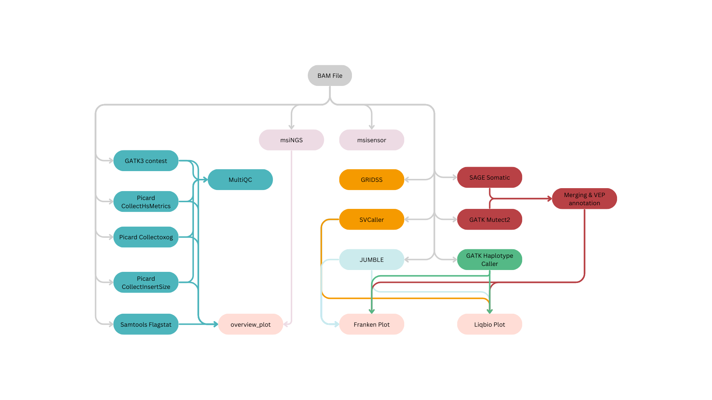
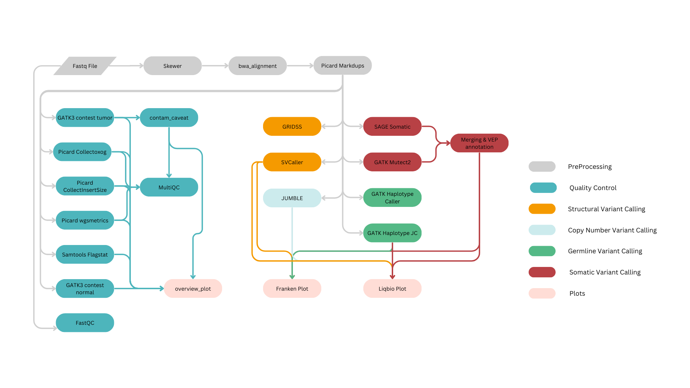
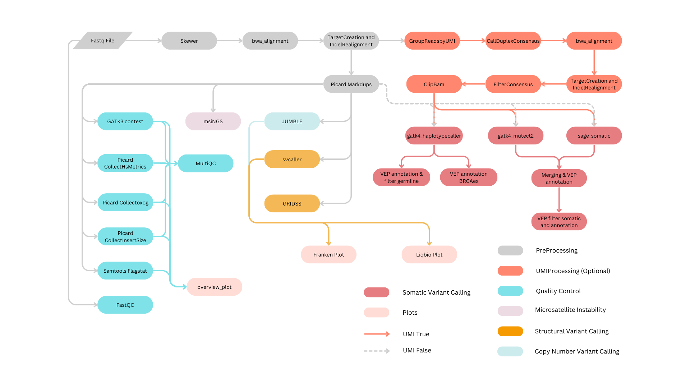

# Autoseq - pipeline

The Autoseq pipeline is primarily designed for liquid biopsy samples but is also highly effective for tissue biopsy samples with minor configuration adjustments. This pipeline requires both tumor and matched normal samples, with input FASTQ files in `.fastq.gz` or `.fq.gz` format. Input file names should follow the format: PROJECT-SDID-TYPE-SAMPLEID-PREPID-CAPTUREID (e.g., `PB-P-00462065-CFDNA-04055058-KH20221214-C420221214.fastq.gz`). For details on this naming format, please refer to the [General Description](barcodes.md) page. 

The current workflow includes five distinct pipelines: 

1. autoseq 
2. autoseq-rerun 
3. autoseq-wgs 
4. autoseq-sd 
5. tumor-only 

## 1. Autoseq Pipeline

The primary Autoseq pipeline is optimized for targeted variant analysis. Capture kits focus on different target genes, such as 94 genes in the Probio panel. When using a new capture kit, specify the associated reference files (e.g., `.bed`, `interval_list`) under `/nfs/PIPELINE/autoseq-genome/intervals/targets/` and update the `autoseq-genome.json` file accordingly. Also, ensure the `capture_kit_lookup` dictionary in the `utils.py` script is updated so that the pipeline can automatically select the appropriate reference file during analysis. 

Here’s a sample configuration in the `autoseq-genome.json` file:

```
"targets": {
        "alascca_core": {
            "blacklist-bed": null, 
            "msings-baseline": null, 
            "msings-bed": null, 
            "msings-msi_intervals": null, 
            "msisites": "intervals/targets/alascca_core.slopped20.msisites.tsv", 
            "purecn_targets": null, 
            "targets-bed-slopped20": "intervals/targets/alascca_core.slopped20.bed", 
            "targets-bed-slopped20-gz": "intervals/targets/alascca_core.slopped20.bed.gz", 
            "targets-interval_list": "intervals/targets/alascca_core.interval_list", 
            "targets-interval_list-slopped20": "intervals/targets/alascca_core.slopped20.interval_list"
        },
        "your_new_capture_kit_name": {
            "blacklist-bed": null, 
            "msings-baseline": null, 
            "msings-bed": null, 
            "msings-msi_intervals": null, 
            "msisites": "/path/to/your_new_capture_kit.slopped20.msisites.tsv", 
            "purecn_targets": null, 
            "targets-bed-slopped20": "/path/to/your_new_capture_kit.slopped20.bed", 
            "targets-bed-slopped20-gz": "/path/to/your_new_capture_kit.slopped20.bed.gz", 
            "targets-interval_list": "/path/to/your_new_capture_kit.interval_list", 
            "targets-interval_list-slopped20": "/path/to/your_new_capture_kit.slopped20.interval_list"
        } 
}
```

The pipeline can be run with or without the UMI parameter; enabling the UMI parameter will add an additional preprocessing step for Unique Molecular Identifier (UMI) handling.

The Autoseq pipeline is organized into seven primary stages:

* Preprocessing and UMI Processing
* Germline Variant Calling
* Somatic Variant Calling
* Copy Number Variant Calling
* Structural Variant Calling
* Microsatellite Instability
* QC steps 


**Figure 1a:** This diagram shows the overall workflow for autoseq pipeline. Here different type of processes are highlighed with different colors. The preprocessing, UMI processing, microsatellite instability, quality check, somatic variant calling, germline variant calling, copy number analysis, structural variant calling and plots are mentioned in grey, orange, plum, blue, dark orange, green, light blue, dark yellow and light orange respectively. 


**Preprocessing and UMI Processing**

This stage includes key preparatory steps like trimming, UMI processing, BWA alignment, and indel realignment. The input FASTQ files undergo trimming using the tool Skewer, which identifies and removes adapter sequences. The trimmed FASTQ files then proceed to UMI processing, where fgbio tools such as `GroupReadsByUmi`, `CallDuplexConsensus`, and `FilterConsensus` are employed. During this stage, FASTQ files are converted to uBAM files. Following alignment with BWA, the resulting BAM files are merged with uBAM files to retain UMI data. Indel realignment is then performed using GATK's `TargetCreator` and `IndelRealigner` to improve alignment accuracy around indel regions. The processed BAM files, with UMI data preserved and realigned indel regions, are used to group reads by UMI with `GroupReadsByUmi`. Consensus reads are generated with `CallDuplexConsensus`, re-aligned with BWA, and subject to further indel realignment.

Once we group reads based on consensus, we can observe that true variants are present in most of the reads that has same UMI, where as false variants that arise due to sequencing error will present only in a small fractions of reads that has same UMI. Fgbio's FilterConsensusReads uses this and few other concept to filter variants that are probably arising from sequencing artifacts. To know more about all the filters that are applied, you can visit [fgbio's FilterConsensusReads page](http://fulcrumgenomics.github.io/fgbio/tools/latest/FilterConsensusReads.html). Finally, fgbio's clipbam is used to clip N bases from the end of either R1 or R2 so that variants present in end of consensus reads are not counted twice (if not clipped, the variants present in both R1 and R2 will be counted as 2 variants; though technically only 1 variant is present in forward and reverse strand.)

Once the preprocessing and UMI processing steps are completed, the remaining steps can be run in parallel.

**Germline Variant Calling**

Germline variant identification in normal samples is conducted using [GATK's haplotypecaller](https://gatk.broadinstitute.org/hc/en-us/articles/360037225632-HaplotypeCaller) which accurately locates potential mismatches, reassembles reads, and calls variants. The resulting variant call file is then annotated with [VEP](https://www.ensembl.org/info/docs/tools/vep/index.html).

**Somatic Variant Calling**

Somatic variants are identified using both [GATK's Mutect2](https://gatk.broadinstitute.org/hc/en-us/articles/360037593851-Mutect2) and [SAGE somatic](https://github.com/hartwigmedical/hmftools/blob/master/sage/README.md). Mutect2 employs a Bayesian genotyping model, while SAGE utilizes a nine-step algorithm covering metrics like Tumor Counts and Quality, Normal Counts and Quality, and de-duplication. The results are merged using [somaticseq](https://github.com/bioinform/somaticseq/blob/master/docs/Manual.pdf) which applies a machine-learning model to minimize false positives.

**Copy Number Variant Calling**

Copy number variants (CNVs) are identified with JUMBLE. The pipeline also generates `liqbiocna` and `franken plots` for visualization  

**Structural Variant Calling**

Structural variants are called using [svcaller](https://github.com/tomwhi/svcaller) which follows an algorithm similar to Delly, and [GRIDSS](https://github.com/PapenfussLab/gridss). which leverages alignment-guided positional de Bruijn graphs and read-pair evidence for genome-wide variant assembly.

**Microsatellite Instability**

MSI is indicative of DNA mismatch repair issues. Detection is performed with both [msiNGS](https://bitbucket.org/uwlabmed/msings/src/master/) and [MSIsensor](https://github.com/ding-lab/msisensor). msiNGS assesses the variability in repeat lengths between tumor and normal samples, while MSIsensor applies Pearson’s Chi-Squared Test for comparative analysis.

**QC steps**

The Autoseq pipeline integrates several tools to verify quality at different stages. [FastQC](https://www.bioinformatics.babraham.ac.uk/projects/fastqc/) checks the input FASTQ files for read quality, while  [samtools flagstats](http://www.htslib.org/doc/samtools-flagstat.html) assesses BAM file quality. Various Picard tools are used to evaluate library metrics, including [CollectHsMetrics](https://gatk.broadinstitute.org/hc/en-us/articles/360036856051-CollectHsMetrics-Picard) for GC bias, [MarkDups](https://gatk.broadinstitute.org/hc/en-us/articles/360037052812-MarkDuplicates-Picard) for duplicate reads, [CollectInsertSizeMetrics](https://gatk.broadinstitute.org/hc/en-us/articles/360037055772-CollectInsertSizeMetrics-Picard)  for insert size metrics and [collectOxoGMetrics](https://gatk.broadinstitute.org/hc/en-us/articles/360037428231-CollectOxoGMetrics-Picard) to validate the library construction process. GATK's [ContEst](https://github.com/broadinstitute/gatk-docs/blob/master/gatk3-tooldocs/3.6-0/org_broadinstitute_gatk_tools_walkers_cancer_contamination_ContEst.html) estimates sample cross-contamination, and PureCN evaluates tumor purity, ploidy, copy number, and LOH.

### Pipeline Detailed Workflow


**Figure 1b:** Complete DAG diagram for the autoseq pipeline is shown in this diagram. Here, the postprocessing step is highlighted in light yellow. All other color code is similar to the above diagram.


## 2. Autoseq re-run pipeline

The Autoseq re-run pipeline is specifically designed to initiate analysis from a BAM file. This is particularly useful if the original pipeline is interrupted after alignment is complete, or if only a duplicate-removed BAM file is available instead of FASTQ files. The tools employed here are identical to those used in the standard Autoseq pipeline.


**Figure 2:** The Autoseq Re-run Pipeline workflow diagram, highlighting different processes by color. Steps for preprocessing, quality checks, somatic and germline variant calling, copy number analysis, structural variant calling, and plotting are represented in grey, blue, dark orange, green, light blue, dark yellow, and light orange, respectively.

### Launching rerun Pipeline:

Launching the Autoseq Re-run Pipeline is similar to the standard Autoseq pipeline. However, here you need to specify the path to the BAM file using the `--libdir` parameter and set `--pipeline autoseq-rerun`. Below is an example command for initiating the Autoseq Re-run Pipeline:

```
autoseq launch -r /path/to/autoseq-genome/autoseq-genome.json \
        --samples /path/to/sample.json \ 
        --outdir /path/to/autoseq-output/ \
        --libdir /path/to/autoseq-output/sdid/ \ 
        PROJECT-SDID-CFDNA-SAMPLEID-PREPID-CAPTUREID_\
        PROJECT-SDID-N-SAMPLEID-PREPID-CAPTUREID/bams/ \
        --use-singularity --singularity /path/to/container_dir \
        --cores 8 --pipeline autoseq-rerun --smk-opt " --singularity-args\
        '--bind /base-path/:/base-path/'"
```

## 3. Autoseq WGS Pipeline

The Autoseq WGS Pipeline is designed for whole genome sequencing (WGS) analysis. Unlike the standard Autoseq pipeline, this pipeline does not incorporate unique molecular identifiers (UMIs). Additionally, germline variants in the tumor sample are identified by running the Haplotype Caller (rule: gatk4_haplotypecaller_jc), as these variants contribute to the copy number analysis for generating liqbio and franken plots. For quality metrics, WGSmetrics is utilized in place of CollectHsMetrics. Both tumor and matched normal samples are required for this pipeline, with the remaining steps closely mirroring those in the standard Autoseq pipeline.


**Figure 3:** The workflow for the Autoseq WGS pipeline, with different processes distinguished by color: preprocessing, quality checks, somatic variant calling, germline variant calling, copy number analysis, structural variant calling, and plotting are represented in grey, blue, dark orange, green, light blue, dark yellow, and light orange, respectively.

### Launching WGS Pipeline:

The WGS pipeline can be launched similarly to the standard Autoseq pipeline, with the addition of the parameter `--pipeline autoseq-wgs`. Below is an example command for launching a WGS sample:

```
autoseq launch -r /path/to/autoseq-genome/autoseq-genome.json \
        --samples /path/to/sample.json \ 
        --outdir /path/to/autoseq-output/ \ 
        --libdir /path/to/input_directory/ --use-singularity \ 
        --singularity /path/to/container_dir \
        --cores 8 --pipeline autoseq-wgs --smk-opt " --singularity-args\
        '--bind /base-path/:/base-path/'"
```

### Launching WGS Pipeline on the Ravenclaw Server:

At KI, WGS samples are received in batches, often with directory names that do not conform to the [recommended](quick_start/barcodes.md) format. To align with the expected format, create a new directory within the input directory and set up symbolic links to all input FASTQ files within it, using the following command:

```
for dpath in /path/to/INBOX/batch_n/DNA-*;do
	base=`basename $dpath`;
	sampletype=`echo $base | awk -F "-" '{if ($2 == "B") {print "N"} \
                else {print $2}}'`
	sdid=`echo $base | awk -F "-" '{if (NF == 4) {print $3$4} \
                else {print $4$5}}' | sed -e "s/WGS//g"`
	barcode=`echo SARC-P-$sdid-$sampletype-$sdid-\
                KH$(date '+%Y%m%d')-WG$(date '+%Y%m%d')`
	mkdir /path/to/INBOX/$barcode
	ln -s $dpath/* /path/to/INBOX/$barcode
	echo $base $barcode
done
```

Once formatted and linked, you can proceed with preparing configuration files as described in the [launching samples in server](server_launch.md/#preparing-config-file) page.

## 4. Autoseq Tumor-Only Pipeline:

The Tumor-Only Pipeline is utilized when there is no matched normal sample available for the tumor sample. In such cases, provide a Panel of Normal (PON) BAM file with the `--normal /path/to/panel_of_normal.bam`. option. At Karolinska Institute, a specialized PON has been developed for each project, available for download upon request.


**Figure 4:** This diagram illustrates the workflow for the Autoseq whole genome sequencing pipeline. Different process types are represented by distinct colors: preprocessing (grey), quality checks (blue), somatic variant calling (dark orange), germline variant calling (green), copy number analysis (light blue), structural variant calling (dark yellow), and plotting (light orange).

### Launching the Tumor-Only Pipeline:

The Tumor-Only Pipeline can be launched similarly to the standard Autoseq pipeline, with the addition of two parameters: `--pipeline tumor_only` and `--normal-bam /path/to/panel_of_normal/bams/` to specify the location of the panel of normal BAM file. Below is an example command for launching a tumor-only sample:

```
autoseq launch -r /path/to/autoseq-genome/autoseq-genome.json \
        --samples /path/to/sample.json \ 
        --outdir /path/to/autoseq-output/ \ 
        --libdir /path/to/input_directory/ --use-singularity \ 
        --singularity /path/to/container_dir \
        --pipeline tumor_only --normal-bam /path/to/panel_of_normal/bams/ \
        --cores 8 --pipeline tumor_only --smk-opt " --singularity-args\
        '--bind /base-path/:/base-path/'"
```
