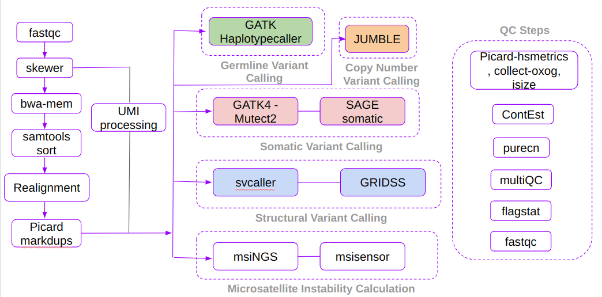
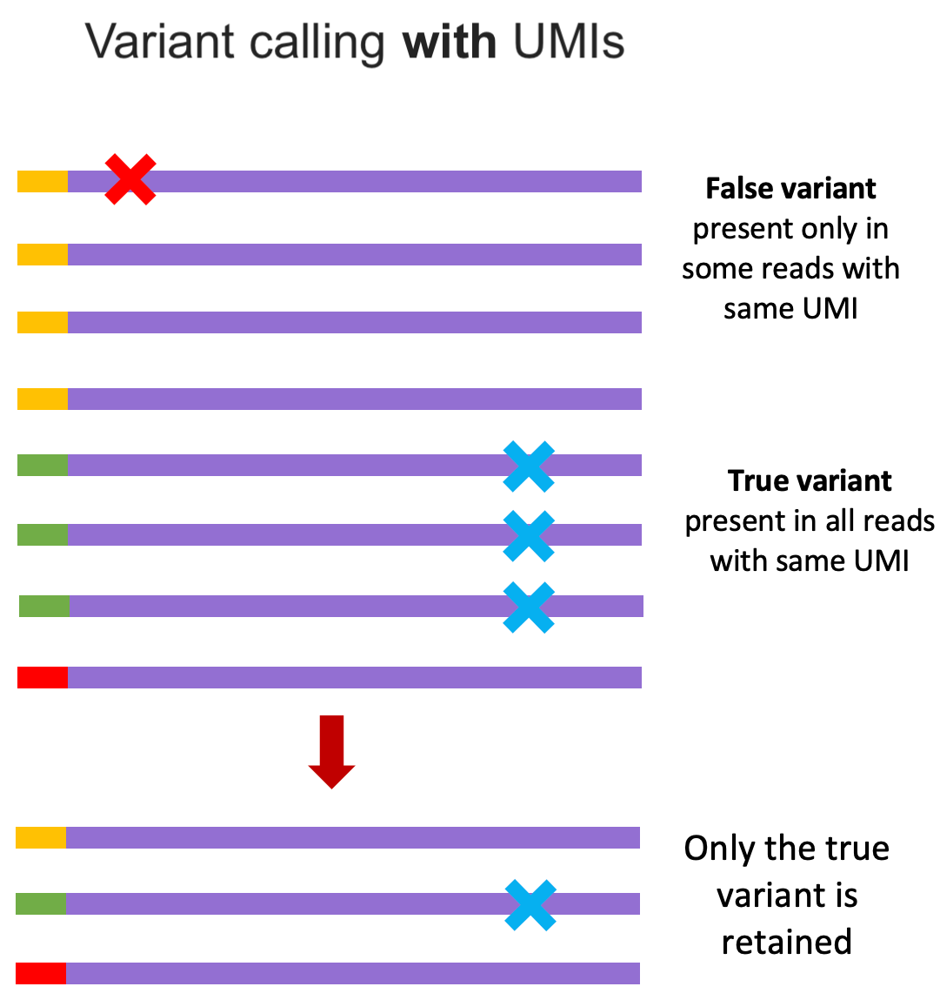

# Autoseq - Pipeline

Autoseq pipeline is specifically designed to run liquid biopsy samples, however, it performs equally well with tissue biopsy samples with minor modification to the recommended settings. This pipeline requires both tumor and matched normal samples; and the input fastq file has to be either in the format of fastq.gz or fq.gz. Additionally, the input file name has to be specified in the format `PROJECT-SDID-TYPE-SAMPLEID-PREPID-CAPTUREID`. For example: PB-P-00462065-CFDNA-04055058-KH20221214-C420221214.fastq.gz. To know more about this format, [visit Barcodes page](barcodes.md). This pipeline can be called either with or without umi parameter. If we specify umi parameter, UMI processing will be performed.

This pipeline can be broadly classified into 7 major steps. They are

* Preprocessing and UMI Processing
* Germline Variant Calling
* Somatic Variant Calling
* Copy Number Variant Calling
* Structural Variant Calling
* Microsatellite Instability
* QC steps 

**Pipeline workflow**

**Preprocessing and UMI Processing**

This step covers various sub-steps such as trimming, UMI processing, bwa alignment, indel realignment etc. For trimming the input fastq file, we are using a tool called skewer. It automatically identifies adapter sequence and removes them from each reads. Once trimming process is completed, the resulting trimmed fastq file will be passed to UMI processing step. For UMI pre-procssing we are using fgbio's groupreadsbyumi, callduplexconsensus, and filterconsensus. During UMI preprocessing stage, the input fastq files be converted to ubam file. Then the bwa alignment will be carried out for the trimmed fastq files and the resulting bam file will be merged with the previously generated ubam file, so that the UMI information will be preserved in the final bam file. Then an indel realignment step is performed in the bam file with the help of gatk's targetcreator and indelrealigner to improve the accuracy of alignment near indel regions.

Once the bam file with UMI information is generated and indels regions are re-aligned, we will group reads based on UMI using fgbio's groupreadsbyumi and consequtively call consensus reads with fgbio's callduplexconsensus. The resulting bam file will then be converetd to fastq file, bwa aligned, and indel regions will be re-aligned.    

Reference: [https://help.geneiousbiologics.com/hc/en-us/articles/4781289585300-Understanding-Single-Cell-technologies-Barcodes-and-UMIs](https://help.geneiousbiologics.com/hc/en-us/articles/4781289585300-Understanding-Single-Cell-technologies-Barcodes-and-UMIs){: style="height:50px;width:50px"}

Once we group reads based on consensus, we can observe that true variants are present in most of the reads that has same UMI, where as false variants that arise due to sequencing error will present only in a small fractions of reads that has same UMI. Fgbio's FilterConsensusReads uses this and few other concept to filter variants that are probably arising from sequencing artifacts. To know more about all the filters that are applied, you can visit [fgbio's FilterConsensusReads page](http://fulcrumgenomics.github.io/fgbio/tools/latest/FilterConsensusReads.html). Finally, fgbio's clipbam is used to clip N bases from the end of either R1 or R2 so that variants present in end of consensus reads are not counted twice (if not clipped, the variants present in both R1 and R2 will be counted as 2 variants; though technically only 1 variant is present in forward and reverse strand.)

Once the preprocessing and UMI processing steps are completed, the remaining steps can be run in parallel.

**Germline Variant Calling**

For normal sample, we use [GATK's haplotypecaller](https://gatk.broadinstitute.org/hc/en-us/articles/360037225632-HaplotypeCaller) to identify all germline variants (including SNPs and INDELs). This tool locates the positions where there is a probable mismatch in bam file and reassembles reads in that region, thus calling variants with increased accuracy. Once the variant call file is generated, it is annotated using [VEP](https://www.ensembl.org/info/docs/tools/vep/index.html).

**Somatic Variant Calling**

To identify somatic variants, we use two different tools. They are [GATK's Mutect2](https://gatk.broadinstitute.org/hc/en-us/articles/360037593851-Mutect2) and [SAGE somatic](https://github.com/hartwigmedical/hmftools/blob/master/sage/README.md). Mutect2 uses a Bayesian somatic genotyping model to identify variants, while SAGE somatic algorithm uses 9 keys steps to call somatic variants. They are Alt Specific Base Quality Recalibration, Candidate Variants, Tumor Counts and Quality, Normal Counts and Quality, Soft Filters, Phasing, De-duplication and Gene Panel Coverage. The variants identified from these two tools will then be merged using [somaticseq](https://github.com/bioinform/somaticseq/blob/master/docs/Manual.pdf) which uses machine learning model to filter out false positive from these two variant callers.

**Copy Number Variant Calling**

For calling copy number variants, we use a tool called JUMBLE. Once copy number analysis is completed, autoseq pipeline will also generate two plots. They are libio-cna plot and franken plot.  

**Structural Variant Calling**

For structural variant calling, we use [svcaller](https://github.com/tomwhi/svcaller) and [GRIDSS](https://github.com/PapenfussLab/gridss). svcaller uses an algorithm similar to Delly. GRIDSS calls variants based on alignment-guided positional de Bruijn graph genome-wide break-end assembly, split read, and read pair evidence.

**Microsatellite Instability**

Microsatellite Instability provides a glimps into the underlying issues with DNA mismatch repair mechanism. To detect the MSI status, we use two tools called [msiNGS](https://bitbucket.org/uwlabmed/msings/src/master/) and [MSIsensor](https://github.com/ding-lab/msisensor). msiNGS compares the number of differently sized repeats within the microsatellite locus of tumor and normal sample. Loci were considered unstable if the number of repeats in tumor was statistically greater than the number of repeats in normal. MSIsensor uses Pearson's Chi-Squared Test to compare the number of repeats in microsatellite locus between tumor and normal sample.

**QC steps**

Autoseq pipeline utilizes various tools to ensure the generated results in various stages are of good quality. In the initial fastq file, we use [FastQC](https://www.bioinformatics.babraham.ac.uk/projects/fastqc/) to check the quality of input reads. Once the fastq files are aligned, we use [samtools flagstats](http://www.htslib.org/doc/samtools-flagstat.html) to check the overall quality of aligned BAM file. Further, we use various tools in Picard such as [CollectHsMetrics](https://gatk.broadinstitute.org/hc/en-us/articles/360036856051-CollectHsMetrics-Picard) to identify GC bias, [MarkDups](https://gatk.broadinstitute.org/hc/en-us/articles/360037052812-MarkDuplicates-Picard) to identify duplicate reads, [CollectInsertSizeMetrics](https://gatk.broadinstitute.org/hc/en-us/articles/360037055772-CollectInsertSizeMetrics-Picard) and [collectOxoGMetrics](https://gatk.broadinstitute.org/hc/en-us/articles/360037428231-CollectOxoGMetrics-Picard) to validate the library construction process. GATK's [ContEst](https://github.com/broadinstitute/gatk-docs/blob/master/gatk3-tooldocs/3.6-0/org_broadinstitute_gatk_tools_walkers_cancer_contamination_ContEst.html) tool is used to estimate the level of cross contamination between sequencing data. And, finally, purecn is used to estimate tumor purity and ploidy, copy number and loss of heterozygosity.

